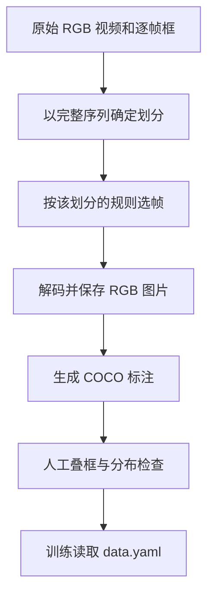

# 02 Anti-UAV 数据集抽帧与质量检查

## 1. 为什么不能直接随机抽图片再划分

Anti-UAV 是视频数据。相邻帧往往只有几个像素的变化。如果先抽出所有帧，再随机按图片划分 train/test，训练集里可能出现测试帧的前一帧，得到虚高且不可解释的结果。

正确顺序是：先确定整个序列属于 train、val 还是 test，再在每个序列内部抽帧。



本项目只读取每个序列的 `visible.mp4` 和 `visible.json`。`exist=1` 对应一个 `gt_rect`；本地数据的框格式是 `[x,y,w,h]`。`exist=0` 的帧可以作为负样本，但原数据来自单目标跟踪任务，所以它不能自动证明画面中绝对不存在其他无人机。

## 2. 推荐先使用配置文件

复制 [抽帧配置模板](../../configs/antiuav_extraction.example.yaml)，给副本起一个能说明版本的名字：

```powershell
Copy-Item 'configs\antiuav_extraction.example.yaml' 'configs\antiuav_extraction_official_v1.yaml'
```

修改副本中的 `output_root`，每套采样策略必须用不同输出目录。例如：

```yaml
extraction:
  source_root: F:/antiuav/main_workspace/Anti-UAV-RGBT
  output_root: F:/antiuav/TSCRNet/BCRNet-main/data/antiuav_rgb_official_v1
  split_policy: official
  seed: 42
```

配置文件给出默认值；命令行参数会覆盖同名配置。例如临时把负帧步长改为 10：

```powershell
python scripts/extract_antiuav.py --config configs/antiuav_extraction_official_v1.yaml --negative-stride 10 --dry-run
```

为了复现，正式产物应直接把最终值写进独立 YAML，而不是只依靠终端历史。

## 3. 参数逐项解释

### 3.1 原始数据参数

| YAML 键 / CLI | 默认值 | 含义 |
| --- | --- | --- |
| source_root / `--source-root` | 必填 | 原始 Anti-UAV 根目录 |
| output_root / `--output-root` | 必填 | 新的抽帧输出目录；存在时拒绝覆盖 |
| source_splits / `--source-splits` | train val test | 读取哪些原始划分；正式数据建议全部读取 |
| video_name / `--video-name` | visible.mp4 | RGB 视频文件名 |
| annotation_name / `--annotation-name` | visible.json | 逐帧标注文件名 |
| attribute_dir_name | label_new | 序列属性目录名 |
| include_attributes / `--no-include-attributes` | true | 是否将未经验证的序列属性写入图像元数据 |
| bbox_format / `--bbox-format` | xywh | 原始 gt_rect 格式；本地 Anti-UAV 应保持 xywh |

### 3.2 划分参数

| 参数 | 默认值 | 含义 |
| --- | --- | --- |
| split_policy | official | official 保留原划分；group 重分原 train+val；custom 读取明确划分表 |
| val_fraction | 0.2 | group 策略中验证拍摄组的比例 |
| seed | 42 | 分组洗牌和每个序列采样相位的随机种子 |
| split_map | null | custom 策略使用的 JSON 文件 |

自定义划分表是 JSON 对象，键必须覆盖本次读取的每个 `来源划分/序列名`，值只能是 train、val、test：

```json
{
  "train/20190925_101846_1_1": "train",
  "val/20190925_101846_1_2": "val",
  "test/20190926_120000_1_1": "test"
}
```

脚本禁止把原 test 移入 train 或 val。划分表有缺项、多余项或非法值时直接停止。

### 3.3 训练帧采样参数

| 参数 | 默认值 | 含义与消融用途 |
| --- | --- | --- |
| train_stride | 5 | 正/负步长未单设时共同继承此值 |
| positive_stride | null | 正帧独立步长；可研究目标帧密度 |
| negative_stride | null | 负帧独立步长；可研究背景比例和误报 |
| tiny_densification | true | 是否对 tiny 正帧额外加密；可直接做数据策略消融 |
| tiny_stride | 2 | tiny 帧额外采样步长 |
| tiny_threshold | 16 | 缩放到参考尺寸后，`sqrt(w*h)` 小于该值视为 tiny |
| reference_size | 640 | tiny 判断使用的等比例 letterbox 参考边长，应与训练输入对应 |
| transition_sampling | true | 是否加采样 exist 出现/消失边界 |
| transition_radius | 2 | 状态改变位置前后额外保留多少帧 |
| max_train_frames | 400 | 每序列训练帧上限；0 表示不设上限 |
| negative_fraction_at_cap | 0.25 | 超过上限时为负帧预留的目标比例 |
| phase_policy | hashed | hashed 为每序列确定性错相；zero 固定取 0、stride、2×stride… |

默认 `positive_stride=null` 和 `negative_stride=null` 会同时继承 `train_stride=5`，因此与旧版脚本行为一致。hashed 相位避免所有视频都只取相同时间位置，同时相同 seed 和序列名会得到同一结果。

tiny 加密和状态边界采样只用于 train。val/test 不根据 GT 难度挑帧，否则评估分布会被人为改变。

### 3.4 验证、测试和导出参数

| 参数 | 默认值 | 含义 |
| --- | --- | --- |
| eval_stride | 1 | val/test 未单设时共同继承 |
| val_stride、test_stride | null | 分别覆盖验证/测试步长；正式最终评估建议为 1 |
| image_format | jpg | jpg 或 png |
| jpeg_quality | 95 | JPEG 质量 1–100 |
| png_compression | 3 | PNG 压缩等级 0–9；不改变像素但影响体积/解码开销 |
| category_id/name/supercategory | 1/drone/uav | COCO 类别元数据 |
| invalid_box_policy | skip | 原标注行非法时记录并跳过；error 用于严格审计 |
| clipped_box_policy | skip | 框裁剪后无面积时记录并跳过；error 用于严格审计 |
| dry_run / `--dry-run`、`--no-dry-run` | false | 只检查标注、视频元数据和采样计划，不写任何文件；命令行可覆盖 YAML |

图像编码变化会改变模型看到的像素。比较 BCRNet 结构时应固定编码参数；研究数据编码本身时才把它作为实验变量。

## 4. 第一次运行：只做 dry-run

先把 YAML 中 `dry_run` 改为 true，或命令行追加 `--dry-run`：

```powershell
python scripts/extract_antiuav.py --config configs/antiuav_extraction_official_v1.yaml --dry-run
```

它会读取标注和视频元数据，检查视频帧数是否等于标注长度，并打印计划。它不会保存图片和 JSON。重点检查：

- train、val、test 序列是否都被发现；
- 每个序列计划帧数是否异常为 0 或全部达到上限；
- ignored_frames 是否集中在某些序列；
- FPS、分辨率和帧数是否合理；
- split_policy 和 sampling 是否与 YAML 一致。

dry-run 输出较长，PowerShell 可显式保存日志供人工检查：

```powershell
python scripts/extract_antiuav.py --config configs/antiuav_extraction_official_v1.yaml --dry-run | Tee-Object 'runs\extract_official_v1_dry_run.txt'
```

这条命令只保存终端报告，不保存抽帧数据。

## 5. 正式抽帧

确认计划后移除 `--dry-run`，并保证 YAML 中 `dry_run: false`：

```powershell
python scripts/extract_antiuav.py --config configs/antiuav_extraction_official_v1.yaml
```

输出结构如下：

```text
data/antiuav_rgb_official_v1/
  images/train/<source_split>_<sequence>/000123.jpg
  images/val/...
  images/test/...
  annotations/train.json
  annotations/val.json
  annotations/test.json
  conversion_report.json
  data.yaml
```

`conversion_report.json` 是这套数据的实验身份证，保存采样参数、划分策略、序列信息、忽略原因和最终数量。counts 还包含每个 split 的正/负帧、参考输入尺度下的 tiny 框数以及逐序列数量。训练时传入生成的 `data.yaml`。

脚本拒绝覆盖已有输出。如果中途失败，目录中可能保留 `status=failed` 的报告和部分图片。修复问题后使用一个新的输出目录；不要把两次产物手工拼接。

## 6. 正式训练前必须人工检查

至少从 train/val/test 各抽若干序列，检查首、中、尾、正帧、负帧、极小框和出现/消失边界。推荐做两类检查：

1. 打开 COCO JSON，确认图片路径存在，bbox 的 x/y/w/h 为正且没有明显越界；
2. 将框画回图片，确认框与无人机对齐，尤其检查快速运动和视频切换附近。

还应统计每个 split 的：图片数、正/负帧数、框尺寸分布、每序列样本数、来源拍摄组。若训练集某个长视频占比过高，优先调整 `max_train_frames`；若负帧太少，调整 `negative_stride` 或 cap 下负帧比例。所有调整只看 train/val，不能根据 test 效果反复改采样策略。

## 7. 数据采样消融应该怎样做

数据策略消融必须重新生成数据目录，而且模型训练设置保持一致。例如：

| 实验 | 只改动的参数 | 回答的问题 |
| --- | --- | --- |
| D0 默认 | 默认配置 | 基准数据协议 |
| D1 无 tiny 加密 | tiny_densification=false | tiny 定向加采样是否有效 |
| D2 无边界加采样 | transition_sampling=false | 出现/消失邻域是否有帮助 |
| D3 更多负帧 | negative_stride=2 | 更多背景是否降低误报 |
| D4 无每序列上限 | max_train_frames=0 | cap 是否损失有效变化或避免长序列支配 |

每套数据使用唯一目录，并保存自己的 `conversion_report.json`。比较时至少同时报告训练图片总数、正/负比例、tiny 比例和每序列分布；数据量变化会改变训练步数，不能把结果全归因于“更好的采样规则”。
