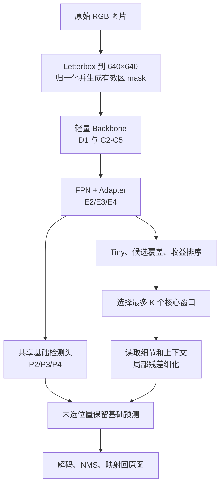

# 03 配置与 BCRNet 全流程

## 1. 一张图如何变成检测框

BCRNet 是单帧 RGB 检测器。普通推理只接收当前图片，不接收红外、前一帧、首帧框或真实标注。



这个设计先让基础路径覆盖全图，再把较贵的细化限制在固定数量的窗口。窗口没有选中不代表该区域被删除，它仍使用基础检测结果。

## 2. 预处理在做什么

默认输入尺寸是 640×640。原图保持长宽比缩放，空余区域填充；有效区 mask 标记哪些像素来自真实图像。RGB 再使用配置中的 mean/std 归一化。

配置来自 `configs/bcrnet.yaml`：

```yaml
preprocessing:
  image_size: 640
  mean: [0.485, 0.456, 0.406]
  std: [0.229, 0.224, 0.225]
```

训练 checkpoint 会保存这组前处理。评估和单图预测从 checkpoint 读取它，因此不能在测试时悄悄换输入尺寸或归一化。

## 3. 三层基础检测输出

在 640 输入下，P2、P3、P4 的空间尺寸约为 160×160、80×80、40×40，对应 stride 4、8、16。每个位置输出：类别中心 logit、中心偏移 dx/dy、框宽高 log 值。

P2 对极小目标最重要，因为它保留较密空间网格；P3/P4 提供较大感受野。后处理会从三层寻找局部峰值，解码为框，执行 NMS，再映射回原图。

这些张量不是最终框。下面代码打印的是未解码预测：

```python
import torch
from bcrnet import BCRNet, ModelConfig

model = BCRNet(ModelConfig()).eval()
images = torch.randn(1, 3, 640, 640)
with torch.no_grad():
    output = model(images, mode="full")
for level, tensor in output.predictions.items():
    print(level, tensor.shape)
```

Anti-UAV 只有一个检测类别，所以每层通道数是 `1 + 4 = 5`。

## 4. 路由和细化在做什么

默认 P2 被分为 8×8 cell 的不重叠核心。640 输入时 P2 为 160×160，因此有 20×20=400 个候选核心。路由最多选择 K=16 个。

选择分两部分：覆盖分数 q 保护已有目标响应或 tiny 响应；收益 U 估计“这个区域经过细化后能改善多少”。默认 `coverage_fraction=0.5`，即预算大致一半给 q，一半给 U。

每个选中核心从浅层 D1 读取细节，从 E3 读取带邻域的语义 token，交给局部细化器。细化器产生 E2 表示残差，共享检测头重新预测该核心。未选 P2 位置、P3 和 P4 保持基础结果。

## 5. 模型配置逐项解释

| 键 | 默认值 | 主要作用 | 常见消融 |
| --- | --- | --- | --- |
| num_classes | 1 | 检测类别数 | 换数据集时修改 |
| stem_channels | 24 | 最浅层宽度 | 速度/容量研究 |
| backbone_channels | 48/96/160/256 | 四阶段通道 | 速度/容量研究 |
| backbone_depths | 1/2/2/2 | 四阶段块数 | 深度消融 |
| width | 64 | FPN、路由和细化主维度 | 48/64/96 等容量对照 |
| core_size | 8 | P2 核心边长 | 4、8、12；必须是 4 的倍数 |
| halo | 4 | P2 单位的上下文外扩 | 0、2、4、8；必须为非负偶数 |
| budget | 16 | 每图最多细化窗口 K | 0/4/8/16/32 |
| coverage_fraction | 0.5 | q 配额占比 | 0、0.25、0.5、0.75、1 |
| objectness_factor | 0.5 | objectness 在 q 中的系数 | 候选分数组成消融 |
| heads | 4 | 注意力头数 | 与 width 整除关系保持一致 |
| blocks | 2 | 局部细化块数 | 1/2/3 |
| mlp_ratio | 2 | FFN 扩展比 | 容量消融 |
| tiny_threshold | 16 | 输入尺度 `sqrt(area)` tiny 阈值 | 数据定义必须同步记录 |
| use_detail | true | 使用 D1 细节 | 去细节消融 |
| use_context | true | 使用 E3 语义上下文 | 去上下文消融 |
| use_tiny | true | 使用 tiny 辅助分支 | 去 tiny 消融 |
| refiner_type | attention | attention 或 conv | 细化器机制对照 |
| patch_chunk_size | 32 | 分批处理窗口数 | 显存参数，不应当作模型创新 |
| default_mode | full | 未显式传 mode 时的路径 | 推荐命令仍显式传 mode |

ModelConfig 会拒绝未知键，避免拼写错误被静默忽略。输入尺寸必须能被 `lcm(32, core_size×4)` 整除。

## 6. 十种 forward mode

| mode | 运行内容 | 主要用途 |
| --- | --- | --- |
| features | 只返回特征 | 研究和调试 |
| base | 只有基础检测 | 核心精度/速度基线 |
| base_tiny | 基础检测 + tiny | 阶段 A 训练 |
| full | q 与 U 双配额细化 | 完整 BCRNet |
| coverage | 只按 q 选窗 | 路由消融 |
| objectness | 只按三尺度目标响应 | 路由消融 |
| utility | 只按 U 选窗 | 路由消融 |
| random | 随机有效窗口 | 同 K 随机对照 |
| dense | 所有有效窗口都细化 | 诊断细化能力，不是正式快速模型 |
| custom | 外部给定索引 | 研究诊断，CLI 不开放 |

`base` 不执行 tiny、路由和细化。`budget=0` 的 full 仍可能执行 tiny 和 U，因此不等于 base。`dense` 忽略预算，容易占用大量显存。

## 7. 训练标签和损失的基本概念

训练内部统一使用输入图像坐标下的 xyxy 框。每个目标根据尺度软分配到 P2/P3/P4，中心 cell 学类别热图、偏移和宽高。背景帧仍参与热图背景损失，回归项为零。

tiny 的定义是输入尺度 `sqrt(width×height) < tiny_threshold`。它与 COCO `area < 32²` 的原图 small 指标不同，论文里不能混用名称。

完整训练还包含：基础检测损失、tiny 辅助损失、细化残差正则和 U 的收益回归损失。U 的监督是同一局部在细化前后的训练损失差，它是 AP 改善的代理，不能直接当作 AP 增益。

## 8. 阅读一次真实输出

训练后可以在 Python 中检查 checkpoint 保存了什么：

```powershell
python -c "import torch; p=torch.load('runs/bcrnet_v01/best.pt', map_location='cpu', weights_only=True); print(p.keys()); print(p['model_config']); print(p['preprocessing'])"
```

你应重点认识：

- `model`：权重；
- `model_config`：结构；
- `preprocessing`：输入尺寸与归一化；
- `category_to_label`：类别映射；
- `epoch/stage/schedule`：训练进度；
- `optimizer/scheduler/scaler`：恢复训练需要的状态；
- `dataset_fingerprint`：训练与验证标注文件指纹。

进入训练前，你至少应能解释为什么 base 仍覆盖全图、K 控制的是额外细化窗口、full 的未选区域为何仍有预测。

