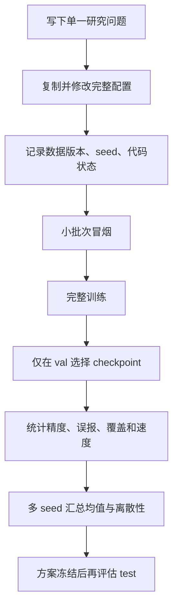

# 06 消融实验设计与执行

## 1. 消融实验到底在回答什么

消融不是“关掉一些模块看看数字”。一个合格对照应提出一个具体问题，只改变回答该问题所需的因素，并保持数据、训练预算、随机种子、评估协议和硬件测量条件一致。

BCRNet 的 story 可以拆成三层问题：

1. 局部细节和语义细化是否比基础检测更有效？
2. 在相同 K 下，双配额 q+U 路由是否比单分数或随机选择更有效？
3. K、halo、窗口大小和模型容量怎样形成精度—计算量权衡？

先回答第一层。如果 dense 或训练引导的细化都不能改善检测，就没有理由先解释复杂路由。

## 2. 两种消融方式必须分开报告

### 2.1 同 checkpoint 切换 mode

优点是权重完全相同，能直接观察当前模型路径的即时影响；缺点是这组权重是按某个训练路径获得的。

适用于：full/base、coverage/objectness/utility/random/dense 的快速机制诊断。

### 2.2 每个结构独立训练

为每个配置建立新输出目录，从相同初始化策略训练，并在相同验证协议下选择 checkpoint。

适用于：去 detail、去 context、去 tiny、attention→conv、width/blocks/core_size 改动。论文主消融通常需要这一类。

## 3. 推荐的分阶段实验矩阵

### 阶段 0：数据和基础检测成立

| ID | 模型/方式 | 回答的问题 |
| --- | --- | --- |
| E0 | base，独立训练 | 基础检测能否建立可靠下限 |
| E1 | base_tiny，独立训练 | tiny 辅助监督是否改善小目标 |

基础模型建议 `--stage A --mode base`；base_tiny 用 `--stage A --mode base_tiny`。如果为匹配完整模型中共享主干的更新 epoch，可先用 65 个 A 阶段 epoch 作为一个预注册方案；也可以统一总 epoch=100。两种口径没有自动绝对公平，必须提前固定并披露。

### 阶段 1：细化模块是否有效

| ID | 配置 | 关键对比 |
| --- | --- | --- |
| E2 | full 默认 | 完整模型 |
| E3 | no_detail | D1 细节是否必要 |
| E4 | no_context | E3 语义上下文是否必要 |
| E5 | conv_refiner | attention 是否优于普通局部卷积细化 |
| E6 | dense 诊断 | 若给所有有效核心细化，模块是否有改善能力 |

no_detail/no_context/conv_refiner 必须重新训练。dense 首先用同 checkpoint 诊断；若作为论文模型对照，要考虑其训练与显存策略，不能只在推理时切 mode 就称为独立模型。

### 阶段 2：路由是否有效

固定结构和 K，对同一训练协议比较：

| mode | 选择规则 | 验证的问题 |
| --- | --- | --- |
| random | 随机有效窗口 | 路由是否优于随机预算 |
| objectness | 三尺度目标响应 | 只看检测置信度是否足够 |
| coverage | tiny 与 objectness 的 q | tiny 候选保护是否有效 |
| utility | 纯 U | 收益估计能否独立工作 |
| full | q+U 双配额 | 双配额是否兼顾覆盖和收益 |

随机路由有额外方差，至少运行多个训练种子。每种 mode 最好独立完成 D 阶段训练；只在 full checkpoint 上切 mode 作为补充诊断。

### 阶段 3：预算与上下文范围

建议先做小网格，再围绕有效区间加密：

- K：4、8、16、32；
- coverage_fraction：0、0.25、0.5、0.75、1；
- halo：0、2、4、8；
- core_size：4、8、12；
- width/blocks：控制容量与速度。

core_size 改变候选网格和每个窗口覆盖面积，所以“同 K”不再代表同覆盖面积或同计算量。报告时同时给 K、核心像素范围、MAC、实测延迟和参数量。

## 4. 配置模板怎么用

项目提供 [消融配置说明](../../configs/ablations/README.md)。每个 YAML 都是完整配置，不依赖隐式继承。例：

```powershell
python -m bcrnet train `
  --config configs/ablations/no_context.yaml `
  --data data/antiuav_rgb_official_v1/data.yaml `
  --output runs/no_context_seed42 `
  --device cuda `
  --mode full
```

另一个种子需要复制 YAML 并修改 `training.seed`，输出目录也要带种子：

```text
runs/full_seed42
runs/full_seed123
runs/full_seed3407
```

不要只改目录名却忘记 YAML 中的 seed。

## 5. 路由 mode 的命令示例

下面以相同默认结构分别训练最终路径。每个命令使用独立目录：

```powershell
python -m bcrnet train --config configs/bcrnet.yaml --data data/antiuav_rgb_official_v1/data.yaml --output runs/route_random_seed42 --device cuda --mode random
python -m bcrnet train --config configs/bcrnet.yaml --data data/antiuav_rgb_official_v1/data.yaml --output runs/route_coverage_seed42 --device cuda --mode coverage
python -m bcrnet train --config configs/bcrnet.yaml --data data/antiuav_rgb_official_v1/data.yaml --output runs/route_utility_seed42 --device cuda --mode utility
python -m bcrnet train --config configs/bcrnet.yaml --data data/antiuav_rgb_official_v1/data.yaml --output runs/route_full_seed42 --device cuda --mode full
```

A/B/C 阶段有自己的训练选窗逻辑；`--mode` 主要决定 D 阶段和每个 epoch 的可部署验证路径。这一点应写进实验方法，不能描述成四个阶段从头到尾都只使用该 mode。

## 6. 结构配置消融的注意事项

| 改动 | 容易犯的错误 | 正确记录 |
| --- | --- | --- |
| use_detail=false | 以为其他计算完全相同 | Reader 输入和参数都会变化，报告真实 MAC/延迟 |
| use_context=false | 仍把 halo 当“语义上下文” | 说明剩余 detail/E2 的实际读取方式 |
| use_tiny=false | 只在推理关掉 | 重新训练，否则辅助监督影响仍留在权重中 |
| refiner_type=conv | 宣称是等计算量对照 | 实测参数、MAC 和延迟，必要时调宽度匹配 |
| budget 改变 | 只推理改 K | 可做预算曲线诊断；最终点最好按协议训练/微调 |
| core_size 改变 | 忽略输入整除约束 | 检查 image_size 能被 `lcm(32,4×core)` 整除 |
| tiny_threshold 改变 | 数据加密仍用旧阈值 | 同步记录抽帧阈值和模型监督阈值 |

## 7. 每次实验的标准执行顺序



每次至少保留：模型 YAML、data.yaml、conversion_report.json 的路径或哈希、run/config.json、metrics.jsonl、best.pt、验证 metrics.json、速度 JSON、随机种子和代码版本标识。

## 8. 结果表建议

主结构消融：

| 实验 | Detail | Context | Tiny | Refiner | K | AP50_95 | AP50 | AP75 | small AP | 负帧误报率 | 延迟 p50 |
| --- | --- | --- | --- | --- | --- | --- | --- | --- | --- | --- | --- |

路由消融：

| 模式 | K | GT 覆盖率 | tiny 覆盖率 | AP50_95 | 负帧误报率 | 每图选窗 | 延迟 |
| --- | --- | --- | --- | --- | --- | --- | --- |

多种子结果至少报告均值和标准差；视频帧有相关性，还应考虑按序列或拍摄组做 bootstrap/宏平均，而不是把每帧假定为完全独立样本。

## 9. 何时停止扩展某条路线

- base 无法在小子集上过拟合：先排查数据与损失；
- dense 也不能改善 base：先重构细化器，不继续堆路由；
- dense 改善但 full 不改善：分析覆盖、U 排序和 K；
- full 只增加 AP50、不改善 AP75：检查定位回归和细化边界；
- small AP 上升但负帧误报大幅上升：不能只宣布小目标更好；
- 结果只在单 seed 或单一划分成立：暂不形成强创新结论。

