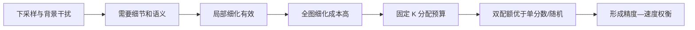

# 07 结果整理与常见问题

## 1. 一次实验结束后先检查什么

不要只抄 AP。按下面顺序核对：

1. `run/config.json` 中的数据根目录、模型配置、mode、seed、batch 与预期一致；
2. `metrics.jsonl` 没有缺失 epoch，阶段顺序正确；
3. AMP 跳过次数没有长期异常；
4. best.pt 对应的验证指标确实是该 run 的最好值；
5. 独立 evaluate 的结果与训练日志中相应 checkpoint 的指标口径一致；
6. 负帧误报、tiny 覆盖和每图选窗没有异常；
7. 速度测量使用同一硬件与同一参数。

## 2. 推荐建立实验登记表

每一行记录一个完整训练 run：

| 字段 | 示例 |
| --- | --- |
| experiment_id | full_k16_seed42 |
| question | 双配额是否优于 coverage-only |
| config | configs/bcrnet.yaml |
| data | data/antiuav_rgb_official_v1/data.yaml |
| extraction_report | data/.../conversion_report.json |
| mode | full |
| seed | 42 |
| output | runs/full_k16_seed42 |
| checkpoint | runs/full_k16_seed42/best.pt |
| status | completed/failed/invalid |
| invalid_reason | 空或明确原因 |

实验失败也保留登记，但不要把失败 run 的部分 epoch 混入正式均值。

## 3. 常见报错速查

### `CUDA requested but unavailable`

PyTorch 当前环境看不到 CUDA。确认激活的是 bcrnet 环境，运行环境检查命令；不要为了“跑起来”就把正式训练切到 CPU 而不记录。

### `Output directory is nonempty`

新训练、评估和预测都要求新目录。继续同一训练使用 `--resume`；新实验换目录。不要删除旧目录来掩盖实验历史。

### `Resume mismatch`

恢复训练时，结构、schedule、数据标注指纹、预处理、batch、workers、mode 或训练配置发生变化。若这些变化是有意的，创建新实验并用 `--weights`；若不是，恢复原参数。

### `Model/train/val category mapping mismatch`

train 与 val 的 COCO categories 不一致，或 `model.num_classes` 与类别数不一致。Anti-UAV RGB 应是一类 drone，三份 manifest 的 category id/name 保持一致。

### `metadata has ... frames, annotation has ...`

视频元数据帧数与 `visible.json` 数组长度不一致。不要强行截断；先人工检查视频、标注版本和帧索引对齐。

### `Refusing to overwrite`

抽帧目标目录已经存在。脚本刻意拒绝覆盖。为新策略换一个带版本号的目录；失败重试也使用新目录。

### AP 为 0 或非常低

依次检查：框是否正确叠加；类别映射；训练 loss 是否下降；单图分数分布；小子集能否过拟合；预测是否全部被阈值/NMS 去除。不要先通过降低展示阈值来宣布模型有效。

### full 比 base 差

先看 dense 是否能改善。如果 dense 也差，问题在细化表示、监督或训练；如果 dense 好而 full 差，问题更可能在路由覆盖或收益排序；如果只在同 checkpoint 切 mode 时差，应再看独立训练结果。

### 显存不足

先减 batch size。dense、较大 K、较大 halo、width 和 blocks 都会增加显存。每次只改一个主因素，并在结果中记录，因为显存处理可能改变训练动态。

## 4. 哪些数字不能混在一起

- COCO 原图 small AP 与输入坐标 tiny 指标；
- 验证集 AP 与测试集 AP；
- 部分 `max-batches` 指标与全量指标；
- 评估循环的 model_ms_mean 与预热后的 benchmark p50；
- MAC 与真实时间；
- 同 checkpoint 切 mode 与独立训练消融；
- 单帧检测 AP 与 Anti-UAV 原论文的跟踪指标。

## 5. 从结果回到 BCRNet story

最终故事应由证据链支撑：基础模型在全图提供检测；tiny/细节/上下文对小目标的具体困难有效；局部细化确实优于基础预测；路由在固定 K 下找到更有价值的区域；K 形成可控的精度—成本曲线。

每一箭头都应有对应实验：

如果某个实验不支持对应箭头，应修改结构或收缩论断，而不是增加无法解释的模块。

## 6. 论文前仍需要补的统计

当前 CLI 已提供总体 COCO 指标、负帧误报和路由覆盖，但完整研究还应补：按输入框尺寸分桶的 AP/Recall、按序列宏平均、按拍摄组的置信区间、多个训练 seed、路由 U 与真实局部改善的相关性、典型成功/失败案例。

这些统计要在预先冻结的验证/测试协议上完成。相邻帧高度相关，不能把几十万帧直接当作同等独立样本来夸大显著性。

## 7. 最小可复现实验包

准备提交论文或交给别人复现时，至少提供：

- 环境定义和实际版本；
- 原始数据版本说明，以及抽帧 YAML、conversion_report；
- 数据划分表或 official/group 规则；
- 每个实验完整模型 YAML；
- 训练命令、随机种子和代码版本；
- best/last checkpoint 的选择规则；
- val/test metrics 与 detections；
- 速度测量脚本参数和硬件条件；
- 失败实验与排除规则。

做到这些，实验结论才可以从“本机跑出一个数字”提升为可复核的研究证据。

