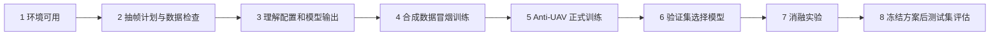

# BCRNet 从零入门教程

这组教程面向第一次接触目标检测工程和 BCRNet 的使用者。它只讨论 BCRNet 模型、Anti-UAV RGB 数据、训练、评估与模型消融，不讨论任何执行或图优化方案。

不要直接从正式训练开始。推荐按下列顺序完成，每一步都有可检查的产物：

| 顺序 | 文档 | 完成标志 |
| --- | --- | --- |
| 1 | [环境准备与工程检查](01_环境准备与工程检查.md) | CUDA、BCRNet 导入和项目测试正常 |
| 2 | [数据集抽帧与质量检查](02_数据集抽帧与质量检查.md) | 抽帧计划合理，叠框抽查通过，生成 data.yaml |
| 3 | [配置与模型全流程](03_配置与模型全流程.md) | 能解释配置、三层预测、路由和细化的关系 |
| 4 | [首次训练与断点恢复](04_首次训练与断点恢复.md) | 合成冒烟训练完成，随后真实训练生成 checkpoint |
| 5 | [测试、评估与单图预测](05_测试评估与单图预测.md) | 能读懂 metrics.json 和 prediction.json |
| 6 | [消融实验设计与执行](06_消融实验设计与执行.md) | 每个对照只回答一个问题，配置和随机种子可追溯 |
| 7 | [结果整理与常见问题](07_结果整理与常见问题.md) | 能定位常见报错，并形成可写进论文的证据表 |

本项目当前是 BCRNet 0.1。代码接口和工程测试已经存在，但真实 Anti-UAV 抽帧、训练与精度评估尚未由本项目自动执行。教程中的正式命令需要你确认抽帧计划和人工标注检查后再运行。

## 三条贯穿全流程的原则

第一，数据划分以视频序列或拍摄组为单位。相邻帧不能随机打散后分别进入训练集和测试集。

第二，验证集用于选择超参数、模型和消融结论；测试集只在方案冻结后使用。重复查看 test 并据此修改模型，会把测试集变成隐含验证集。

第三，每次实验使用新的输出目录，保存完整配置、数据转换报告、checkpoint 和指标。不要手工覆盖旧结果。

