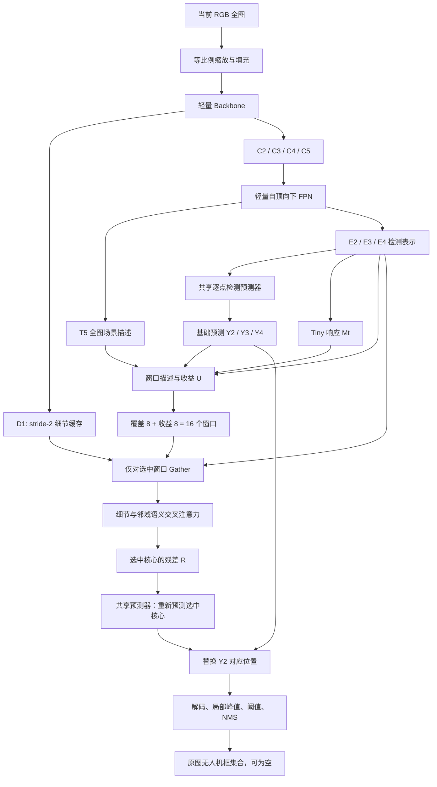

# BCRNet 研究设计（由 TSCRNet-V2 更名）

> 版本：V2.0 研究设计稿  
> 日期：2026-09-06  
> 任务：基于 Anti-UAV 原始论文对应数据构建的单帧、全图、单类 RGB 无人机检测。  
> 状态：本文保留完整研究推导。BCRNet 0.1 已实现；实际代码合同、实现差异和已执行验证分别见 BCRNet详细方案.md、扩展与实验原则.md、验证记录.md。尚无真实 Anti-UAV 精度实验。  
> 输入约束：只使用 RGB 可见光；不使用红外、首帧目标框、历史预测、运动轨迹或未来帧。

## 1. 方案定位与关键决策

BCRNet 的研究中心是：

**在持续进行全图检测的基础上，用有限的区域细化预算补充弱小无人机的空间证据和上下文，并减少增强计算对无关区域的投入。**

V2 保留 V1 的高分辨率检测、尺度监督和残差增强思想，但重构其计算组织方式：

1. 将浅层图像级 tiny 开关，改为语义融合后的区域选择。
2. 将“存在 tiny”与“预计细化收益”拆成两个不同的学习目标。
3. 以固定数量的候选窗口控制额外计算，既提供候选覆盖配额，也提供收益排序配额。
4. 只对被选窗口实际执行细节读取、交叉注意力和前馈网络。
5. 保留 stride-2 特征供局部读取；不在整张 stride-2 特征上执行复杂检测头。
6. 将增强位置移到 Neck 之后的 P2 检测表示；增强不再反馈重算 Backbone。
7. 使用轻量三尺度中心检测头。未选区域仍有基础检测结果，选择器不是最终检测的硬过滤器。

推荐把 BCRNet 的描述名写为：

**BCRNet: Budgeted Contextual Refinement Network**  
中文：**面向微小无人机检测的预算受限上下文细化网络**。

“Budgeted”指每帧最多处理指定数量的区域；“Contextual Refinement”指利用细节与邻域语义更新选定位置。名称不构成创新证明。

### 1.1 默认配置与固定边界

| 项目 | V2 默认决定 |
| --- | --- |
| 数据 | 用户给定的 Anti-UAV 论文对应原始版本；数据包版本另行记录 |
| 模态 | RGB 可见光 |
| 模型输入 | 当前帧完整图像，等比例缩放并填充到 640×640 |
| 输出 | 原图坐标下的无人机框及置信分数，允许空集合 |
| 时序 | 不使用历史帧，不使用第一帧 GT 初始化 |
| 基础检测尺度 | P2 / P3 / P4，stride 4 / 8 / 16 |
| 深层语义 | C5 / T5 保留，stride 32；不设置独立 P5 检测头 |
| 细节缓存 | stride-2、24 通道特征 |
| 细化网格 | P2 上 8×8 cell 的不重叠核心窗口 |
| 局部上下文 | 每个核心向四边扩展 4 个 P2 cell |
| 默认预算 | K=16 个窗口，覆盖配额 8、收益配额 8 |
| 细化器 | 2 个交叉注意力 block，宽度 64，4 heads，MLP 扩展率 2 |
| 全图提前退出 | 默认不启用 |
| 空间稀疏方式 | 先选窗口，再 gather、投影、attention、MLP、scatter |
| 主要优化目标 | tiny 检测质量与真实设备延迟的折中，兼顾背景误报 |

640、通道数、K、tiny 阈值等均是初始实验配置，不是从数据统计或实测中得出的最优值。后续调整应记录为配置变化，不能在测试集上反复择优。

## 2. Anti-UAV 的适用边界与检测协议

### 2.1 已核实的数据事实

用户链接的论文是 *Anti-UAV: A Large Multi-Modal Benchmark for UAV Tracking*，原始任务是单目标跟踪。论文给出 318 对 RGB/热红外序列，160 对训练、67 对验证、91 对测试；提供目标框和存在标记。两个模态没有空间对齐。原始训练与验证来自同一原始视频的不同片段，测试独立；目标位置存在中心区域偏好。[原论文，数据与协议章节](https://arxiv.org/html/2101.08466v3)

本文只取 RGB 数据，并自行明确检测协议。不能把该数据集直接描述为“标准通用目标检测基准”，也不能把本文检测 AP 与原论文跟踪指标视为同一任务的结果。

### 2.2 从跟踪数据构建单帧检测任务

对每个合法 RGB 帧构造：

\[
\mathcal D_t=(I_t,\mathcal B_t,e_t,\mathrm{sequence\_id},\mathrm{frame\_id})
\]

其中：

- \(I_t\)：当前 RGB 帧。
- \(\mathcal B_t\)：审核后有效的无人机框集合；原始跟踪标注通常围绕被跟踪实例。
- \(e_t\)：原始存在标记，作为构建训练目标的依据。
- 序列与帧标识：用于划分、追溯和按序列统计，不输入网络。

推理接口为：

\[
f_\theta(I_t)\rightarrow
\hat{\mathcal B}_t=\{(x_1,y_1,x_2,y_2,p)\}
\]

不得输入首帧框、上一帧框、目标模板、GT 裁剪位置或序列编号。即使无人机离开画面，仍按相同接口处理完整帧。

### 2.3 数据导入必须核实的事项

1. **框格式。** 当前数据包的 visible.json 使用 gt_rect 和 exist；本地样本已核实为 xywh。抽帧脚本默认按 xywh 读取，视频解码帧索引从 0 开始。整批抽帧前仍应人工叠框审核帧对齐和端点约定。转换后内部统一使用连续坐标 xyxy。
2. **存在状态。** exist=0 时不生成目标框；空框、非法框和状态矛盾不能静默当作正常正样本。先审核并建立 ignore 规则。
3. **漏标边界。** “被跟踪实例不存在”不自动等于“画面中没有任何无人机”。检测任务使用负帧前要审核其他无人机及标注完整性；不完整帧补标或设为 ignore，不能直接把所有未标区域视为已确认背景。
4. **修订信息。** 官方仓库列有部分序列的起始帧修正。记录这些修正与本地数据包的对应关系；跟踪初始化起点不能直接用来删除检测任务需要的合法无目标帧。[官方说明](https://github.com/ucas-vg/Anti-UAV#data-annoatation-correction)
5. **划分。** 主结果保留原始划分；不得随机打散相邻帧。训练/验证的同源性必须披露。可另建按原始拍摄序列隔离的辅助验证集，但不能替代或污染官方独立测试。
6. **抽帧。** 训练可按序列均衡抽样以降低相邻帧冗余。主测试保留全部合法帧，完整报告抽帧与忽略规则。
7. **属性。** 当前方案不假定所有原始属性都提供逐帧 RGB 标注。使用低照度、遮挡等分组前须核实模态、粒度和定义，不能直接把红外属性复制给 RGB。

数据统计应至少包含：原图及缩放后目标尺寸直方图、存在/缺席比例、中心位置分布、每序列长度、低对比度与模糊样例。上述统计尚未完成，本文不预设 tiny 帧占比或可获得的加速比例。

## 3. 完整研究故事

### 3.1 应用需求：全图搜索中的小目标精度与每帧成本

反无人机视觉感知需要在天空、云层、建筑物和树木等背景中发现无人机，并在目标进入、离开或再次进入视野时输出合理结果。本方案以单帧全图检测为入口，不借助跟踪初始化缩小搜索范围。

远距离无人机的可用像素可能很少。仅提高网络整体容量会增加每帧计算；只压缩输入或模型又可能损害微弱目标证据。因此需要同时考虑：全图候选覆盖、局部判别能力和每帧额外计算的上限。

### 3.2 困难一：证据稀缺，且更容易受采样与特征压缩影响

微小无人机通常缺少稳定纹理与完整轮廓。缩放、运动模糊及连续下采样可能进一步削弱目标与背景之间的区别。

这要求模型保留更细的空间表示，但不意味着需要在所有高分辨率位置上执行同等复杂的检测与上下文建模。V2 因而保留一张轻量 stride-2 特征，只在选中区域读取其中的信息。

保留特征并不等于恢复成像时不存在的信息。若原图目标经缩放后仅剩极少像素，局部细化也不能保证恢复；输入分辨率必须独立验证。

### 3.3 困难二：增强目标需要上下文，单纯放大响应可能强化干扰

小目标自身证据不足时，背景邻域和较深语义有助于判别。简单地把高响应位置放大，可能同时放大鸟类、局部边缘或其他疑似结构。

因此，细化应让候选位置读取：

- 更细的局部空间证据；
- 核心周围的细节与背景；
- 经过语义融合的邻域特征。

V2 以选定核心位置为 query，以细节区域和邻域语义为 key/value。候选分数只负责选择，默认不再作为强制偏置控制哪些 key 必须被读取。

### 3.4 困难三：包含小目标的帧，也可能只有少量区域需要细化

V1 在检测到 tiny 后开启整张高分辨率特征的增强。若目标持续存在，图像级门控的跳过空间可能有限。

反无人机场景允许提出一个更细的假设：

**额外判别信息的收益可能集中在少数疑似无人机及干扰区域，而不是均匀分布于整张特征图。**

这是假设，不是由“小目标面积小”自动推出的事实。背景误报也可能需要被处理，故选择器不能只学习目标位置。

V2 在每帧保留固定预算 K，使计算选择发生在区域维度；无论目标是否存在，都不依赖“关闭整块增强”获取主要成本收益。

### 3.5 困难四：最需要增强的弱目标，未必拥有最高初始置信度

只按目标分数保留少数窗口，可能反复选择容易目标；只按预测收益排序，又可能因收益模型不成熟而漏掉潜在目标。

V2 将有限预算分成两部分：

1. **候选覆盖配额**：保留目标/微小目标响应较高的区域。
2. **收益排序配额**：在剩余区域中选择预计能改善检测损失的区域，包括弱目标和可能被抑制的假阳性。

两部分均不使用最终置信度阈值先行过滤。覆盖配额只是一种保护策略，并不保证候选召回；其效果必须用窗口覆盖率和最终检测指标检验。

### 3.6 所需能力与结构对应

| 场景问题 | 所需能力 | V2 对应结构 |
| --- | --- | --- |
| 目标证据少、易受压缩影响 | 保留细尺度信息并可局部访问 | stride-2 细节缓存、局部相位重排 |
| 弱目标容易与背景混淆 | 将目标细节与邻域语义联合建模 | 核心 query、带边缘扩展的细节和语义 memory |
| 全图复杂增强成本高 | 让实际执行的细化区域数量受限 | K 个窗口的 gather / refine / scatter |
| 置信度不等于增强收益 | 分离候选识别和资源决策 | tiny 响应、收益回归器、双配额选择 |
| 选择器可能出错 | 全图基础检测持续工作 | 稠密基础结果及区域残差替换 |
| 背景帧也需正确输出 | 学习误报抑制和空结果 | 合法负帧监督、背景窗口收益监督 |

### 3.7 可用于论文引言的方法概述

针对单帧 RGB 反无人机检测中弱小目标证据不足和全图增强成本较高的问题，我们研究预算受限的区域细化。BCRNet 首先以轻量卷积金字塔完成全图特征提取和基础检测，在语义融合后的高分辨率表示上估计小目标相关响应及局部细化收益。模型将固定窗口预算分配给候选覆盖与收益排序两类区域，并仅在被选窗口中读取更细的空间特征和邻域语义，利用交叉注意力生成检测表示的残差更新。基础路径覆盖完整图像，细化路径的额外成本由窗口预算约束。该设计旨在保持弱小无人机检测能力的同时，改善精度与实际推理成本的折中。

### 3.8 待验证假设与创新边界

- H1：在相同预算下，局部细节和邻域语义比单独扩大浅层特征容量更有价值。
- H2：候选覆盖与收益排序共同选择，比相同 K 的随机选择、单一目标分数或单一收益排序更有效。
- H3：tiny 专门监督在通用无人机中心响应之外提供额外选择价值。
- H4：窗口打包执行能在目标硬件上带来端到端收益。
- H5：保留基础路径的监督能降低选择错误造成的检测退化。

QueryDet 已研究由粗位置引导高分辨率稀疏检测；SparseViT 已研究窗口级稀疏计算；DynamicDet 已研究检测损失驱动的动态决策。本文不能主张首次提出这些宽泛思想。V2 的候选贡献在于：**面向弱小 RGB 无人机的候选覆盖与收益排序结合，以及细尺度局部证据和邻域语义共同驱动的预算受限残差细化**。二者是否构成足够的新贡献，需要直接对照与进一步文献检索确认。[QueryDet](https://arxiv.org/abs/2103.09136)、[SparseViT](https://arxiv.org/abs/2303.17605)、[DynamicDet](https://arxiv.org/abs/2304.05552)

## 4. 整体结构与张量约定

### 4.1 总体数据流



Backbone 和 Neck 各执行一次。细化不再改变 C2—C5，也不引发第二轮全图语义提取。选择器只读取细化前的张量，因此不存在“必须先完成细化才能决定细化哪里”的推理循环。

### 4.2 张量表

默认使用 NCHW；区域进入 attention 后使用 token-last。\(B\) 为 batch size，\(K=16\)，\(J=400\)。

| 符号 | 默认形状 | 形式与含义 |
| --- | --- | --- |
| \(I\) | B×3×640×640 | 归一化后的 RGB 全图 |
| \(V\) | B×1×640×640 | 有效图像区域 mask，填充为 0 |
| \(D_1\) | B×24×320×320 | stride-2 早期细节；与下采样主干共享，不是额外编码器 |
| \(C_2\) | B×48×160×160 | stride-4 卷积特征 |
| \(C_3\) | B×96×80×80 | stride-8 卷积特征 |
| \(C_4\) | B×160×40×40 | stride-16 卷积特征 |
| \(C_5\) | B×256×20×20 | stride-32 深层语义 |
| \(T_5\) | B×64×20×20 | C5 的通道投影，参与 Neck 和全局场景描述 |
| \(P_2,P_3,P_4\) | B×64×160² / 80² / 40² | 语义融合后的三尺度特征 |
| \(E_2,E_3,E_4\) | 与对应 P 相同 | 检测适配器输出；E2 是局部细化对象 |
| \(Y_l^b\) | B×5×H_l×W_l | 基础原始预测：中心 logit 1、偏移 2、log 尺寸 2 |
| \(H_l\) | B×1×H_l×W_l | 基础中心响应分数，不是校准的存在概率 |
| \(M_t\) | B×1×160×160 | 专门的 tiny 中心响应 |
| \(v_j\) | B×J×85 | 每个窗口的可观测描述 |
| \(q_j\) | B×J | 候选覆盖优先级；不称为概率 |
| \(U_j\) | B×J | 预计局部损失下降的有符号分数 |
| \(\mathcal S\) | B×K 整数索引 | 选中窗口及有效槽位标记 |
| \(X_D\) | BK×24×32×32 | 被选窗口的 stride-2 细节区域，含 halo |
| \(Z_D\) | BK×256×64 | 细节 memory tokens |
| \(Z_S\) | BK×16×64 | 邻域语义 memory tokens |
| \(Z\) | BK×272×64 | 细节与语义 memory 的拼接 |
| \(Q^0\) | BK×64×64 | 8×8 个核心 query，宽度 64 |
| \(R\) | BK×64×8×8 | 选中核心的细化残差 |
| \(Y_2^f\) | B×5×160×160 | 对选中位置重新预测后得到的最终 P2 预测 |
| \(\hat{\mathcal B}\) | 每图变长 N×5 | 原图 xyxy 框和分数 |

文中的“160²”只用于表格简写，实际形状始终是 H×W，不是一个额外维度。

## 5. 输入处理与轻量 Backbone

### 5.1 模块 M0：RGB 预处理

**作用：** 将任意原图尺寸映射到明确的模型坐标，并保留可逆的几何信息。

输入：

\[
I^{raw}\in\mathbb R^{H_0\times W_0\times3}
\]

输出：\(I,V\) 以及几何元数据 \(\mathcal A=(a_x,a_y,p_x,p_y,H_0,W_0)\)。

先按保持长宽比的比例得到整数缩放尺寸 \(H_r,W_r\)，再对称填充至 640×640。记录实际比例：

\[
a_x=W_r/W_0,\qquad a_y=H_r/H_0
\]

两者因整数舍入可能有微小差异，不强行用同一个浮点值覆盖。坐标变换为：

\[
x'=a_xx+p_x,\qquad y'=a_yy+p_y
\]

训练标签和最后的逆变换都使用同一元数据。RGB 映射到 [0,1]，研究上可由训练集统计均值和标准差并冻结。当前 0.1 实现先使用可配置的 ImageNet 常数，不代表使用 ImageNet 预训练；不按测试序列重新估计。

\(V\) 用于排除纯填充窗口及填充位置的损失和输出；填充图像不能产生背景训练数量上的虚假优势。特征 mask 按相应 cell 的名义输入网格与有效缩放图像是否存在正面积交集确定，不只判断 cell 中心，以免边界附近的真实 GT 中心被舍弃。解码后仍需检查预测中心是否位于有效图像内。

训练可使用亮度、对比度、小幅模糊、平移和有限尺度变化。默认不开启 Mosaic/MixUp，以避免在第一版中同时改变目标密度和背景分布。所有增强在训练划分内部完成。

### 5.2 基本算子定义

为使默认结构可直接实现，固定以下算子：

- Conv(k,s,ci,co)：普通卷积，默认 padding=(k−1)/2，随后 BN、SiLU。
- DS(k,s,ci,co)：DWConv(k,s,groups=ci) → BN → SiLU → PWConv(1,ci→co) → BN → SiLU。
- IR(c)：PWConv(c→2c) → BN → SiLU → DWConv(3,1) → BN → SiLU → PWConv(2c→c) → BN → 与输入相加；最后不额外加激活。
- Lateral(ci,64)：1×1 卷积与 BN，用于相加前的通道投影。
- 稠密路径使用 BN；区域 attention 与 token 投影使用 LN，不在被选 patch 上更新稀疏 BN 统计。

若训练 batch 很小，可统一调整稠密路径归一化方式；必须作为一致的基线设置，不把归一化变化混入模块增益。

### 5.3 模块 M1：共享细节缓存与卷积金字塔

**作用：** 以轻量稠密计算建立全图表示，同时保留后续可能需要的 stride-2 证据。

| 步骤 | 操作 | 输入 | 输出 |
| --- | --- | --- | --- |
| Stem | Conv(3,2,3,24) | I | D1：24×320×320 |
| Stage-2 下采样 | DS(3,2,24,48) | D1 | 48×160×160 |
| Stage-2 建模 | IR(48)×1 | 上一步 | C2：48×160×160 |
| Stage-3 下采样 | DS(3,2,48,96) | C2 | 96×80×80 |
| Stage-3 建模 | IR(96)×2 | 上一步 | C3：96×80×80 |
| Stage-4 下采样 | DS(3,2,96,160) | C3 | 160×40×40 |
| Stage-4 建模 | IR(160)×2 | 上一步 | C4：160×40×40 |
| Stage-5 下采样 | DS(3,2,160,256) | C4 | 256×20×20 |
| Stage-5 建模 | IR(256)×2 | 上一步 | C5：256×20×20 |

表内省略 B 维。Stage 编号对应输出 stride 的指数，和 V1 的 Stage-0—3 命名不同。

D1 是 Stem 本来就计算的特征，仅延长其生命周期供后续局部读取。它仍然经历过一次下采样，因此不能声称“无损保留原始细节”。新增成本包括保存 D1 的显存和局部读取，而不是另建完整的高分辨率 Backbone。

C5 提供更大的感受野，但“stride 32”不等于天然拥有完整全局语义；全图场景描述由后续 GAP 显式产生。

### 5.4 模块 M2：轻量语义融合 Neck

**作用：** 在选择细化区域前，为 P2 提供深层语义，避免只凭极浅局部特征判断 tiny。

输入：C2、C3、C4、C5。

\[
T_5=L_5(C_5)
\]

\[
P_4=DS_{64}\left(L_4(C_4)+Up(T_5)\right)
\]

\[
P_3=DS_{64}\left(L_3(C_3)+Up(P_4)\right)
\]

\[
P_2=DS_{64}\left(L_2(C_2)+Up(P_3)\right)
\]

其中 \(DS_{64}=DS(3,1,64,64)\)，Up 使用 nearest，直接指定目标 H、W。

输出：P2、P3、P4，以及保留的 T5。

这里采用单次自顶向下融合，不用 160 通道的两层 BiFPN。其目的在于降低高分辨率侧的固定成本，使局部细化有现实的预算空间。这是效率取舍，不宣称单向融合优于双向融合。

P5 不独立检测，但 C5/T5 仍参与多尺度语义。较大无人机可由 P3/P4 输出连续尺寸框；若尺度分组结果显示不足，再单独消融恢复 P5。

### 5.5 模块 M3：检测适配器与基础预测器

**作用：** 全图生成基础检测结果，并建立可被局部替换的检测表示。

\[
E_l=DS_l(P_l),\quad l\in\{2,3,4\}
\]

三个 DS 适配器结构一致、参数不共享。此后使用跨尺度共享的逐点预测器 Pred：

\[
Y_l^b=Pred(E_l)
\]

Pred 由三个独立的 1×1 卷积构成：

| 分支 | 原始输出 | 含义 |
| --- | --- | --- |
| Center | 1 channel logit | 该位置是否对应无人机中心 |
| Offset | 2 channels | 中心相对离散 cell 左上角的连续偏移 |
| Size | 2 channels | 宽、高相对该层 stride 的对数 |

将三路按 Center / Offset / Size 拼成 5 通道。Center 使用 sigmoid 得到 \(H_l\)。Offset 保持线性输出，Size 为 log 尺寸。

在 cell (u,v)、stride \(s_l\)：

\[
\hat x_c=s_l(u+\hat o_x),\quad
\hat y_c=s_l(v+\hat o_y)
\]

\[
\hat w=s_l\exp(clip(\hat a_w,-8,8)),\quad
\hat h=s_l\exp(clip(\hat a_h,-8,8))
\]

由中心和宽高恢复 xyxy。内部使用连续坐标，不采用额外“+1 像素面积”的框计算规则。

中心建模借鉴既有的 Objects as Points 思路；本方案不把该检测头作为创新。[Objects as Points](https://arxiv.org/abs/1904.07850)

**为什么要求 Pred 是逐点算子：** 细化后只需对选中核心重新执行 1×1 预测，不必重算整张 P2 的多层 3×3 Head；同时使局部损失差的归因更清晰。全图空间建模已经由 Neck 和 DS 适配器完成。

推理时必须先保留基础原始张量，不在细化前做阈值过滤或 NMS。


## 6. 小目标先验与预算选择

### 6.1 模块 M4：语义融合后的 Tiny 响应

**作用：** 提供区别于通用中心响应的 tiny 候选线索；只预测候选相关性，不直接预测计算收益。

输入：\(E_2\in\mathbb R^{B\times64\times160\times160}\)。

\[
M_t=\sigma(Conv_{1\times1}^{64\rightarrow1}(E_2))
\]

输出：\(M_t\in[0,1]^{B\times1\times160\times160}\)。

由于 E2 已经经过 Backbone、FPN 和适配器，M_t 不再只依赖 V1 极浅 Scale Head 的局部感受野。该分支只增加一个 1×1 卷积，避免用高成本 3×3 路由卷积抵消细化节省。

训练时按**所有图像变换完成后的**框计算：

\[
s_j=\sqrt{w'_jh'_j}
\]

默认 \(T_{\mathrm{tiny}}=16\) 输入像素，仅把 \(s_j<16\) 的目标画成 tiny 中心热图。非 tiny 是该辅助任务的负例，但仍是主检测任务的正例。Tiny / 非 tiny 二分类在这里是明确的任务定义，不会把非 tiny 无人机从最终检测类别中删除。

16 是初始门限，不等同于原数据集某个属性定义。必须做门限敏感性实验，不能依据测试结果重命名尺寸组。

M_t 使用与主头一致的中心热图形式和 Gaussian focal loss，但 tiny 正样本之外没有“必须归一化成三类概率”的要求。这里不计算图像级 p_tiny，不设置全图开关 z，也不使用压低 M_t 来节约计算的损失。

### 6.2 模块 M5：窗口划分与描述

**作用：** 把细化决策转化为有限个规则窗口上的排序问题。

将 E2 划分为 20×20 个不重叠核心：

\[
\Omega_j=[y_j,y_j+8)\times[x_j,x_j+8),\quad
y_j=8a,\ x_j=8b
\]

\(a,b\in\{0,\ldots,19\}\)。每个核心覆盖 8×8 个 P2 cell，即输入图像中 32×32 像素的名义范围。窗口坐标为特征坐标，不是原图像素。

排除不含任何有效 cell 的纯填充窗口。对其余窗口计算：

\[
h_{l,j}=\max_{i\in\Omega_j\cap V_2}\widetilde H_l(i)
\]

\[
t_j=\max_{i\in\Omega_j\cap V_2}M_t(i)
\]

其中 \(\widetilde H_2=H_2\)，H3/H4 以 nearest 对齐到 P2 网格。它们是细化前的基础预测，不来自最终结果。

构造描述向量：

\[
v_j=
[
Avg_{\Omega_j}(E_2),\
h_{2,j},h_{3,j},h_{4,j},\
t_j,\
Avg_{\Omega_j}\mathcal H(H_2),\
g
]\in\mathbb R^{85}
\]

组成分别为：

- 64 维：核心有效位置的平均 E2 特征；
- 3 维：三个尺度的局部中心响应峰值；
- 1 维：tiny 响应峰值；
- 1 维：中心响应的平均二元熵；
- 16 维：全图场景描述 \(g=Linear_{64\rightarrow16}(GAP_V(T_5))\)。

\[
\mathcal H(p)=-p\log(p+\epsilon)-(1-p)\log(1-p+\epsilon)
\]

熵只是可观测输入，不宣称它就是正确的不确定度。全部平均与最大操作排除 padding。窗口原图坐标、序列编号和历史目标位置均不输入描述，减少显式中心位置捷径。

描述向量的作用是概括“这里的语义、基础响应和场景”，并不是一个已经检测出的框。

### 6.3 模块 M6：局部收益回归器

**作用：** 估计“若对窗口 j 进行指定细化，其局部检测损失可能下降多少”。

输入：\(v_j\in\mathbb R^{85}\)。

\[
U_j=MLP(v_j),\qquad MLP:85\rightarrow32\rightarrow1
\]

隐藏层使用 SiLU，末层线性输出。U 可以为正或负，不使用 sigmoid，不称为目标存在概率。

输出：\(U\in\mathbb R^{B\times J}\)。

场景描述的 64→16 投影是收益模块的可训练部分。构造 v 时，只对来自检测网络的 69 维局部统计及 64 维 GAP 输入 stopgrad；场景投影本身和后续 MLP 保留梯度。不能直接 detach 整个 v，否则场景投影将得不到训练。

其标签由同一窗口细化前后的**有监督局部损失差**生成，见第 10 节。U 是当前细化器下的收益代理，不是 AP 增益的直接估计，也不是普适的“图像难度”。

推理只执行 MLP，不运行额外的“先试一遍细化再决定”的路径。训练中的收益探测不能算作推理开销。

### 6.4 模块 M7：双配额窗口选择

**作用：** 让实际细化数量受预算约束，同时避免完全依赖单一排序信号。

先定义候选覆盖优先级：

\[
o_j=\max(h_{2,j},h_{3,j},h_{4,j})
\]

\[
q_j=\max(t_j,\kappa o_j),\qquad \kappa=0.5
\]

q 是人工定义的优先级，不是概率。此设置让 tiny 分支对窗口排序有明确作用，同时保留非 tiny 或 tiny 预测不足时的通用候选。

默认选择：

\[
\mathcal S_{\mathrm{cov}}=TopK(q,8)
\]

\[
\mathcal S_{\mathrm{gain}}
=TopK(U\mid j\notin\mathcal S_{\mathrm{cov}},8)
\]

\[
\mathcal S=\mathcal S_{\mathrm{cov}}\cup\mathcal S_{\mathrm{gain}}
\]

两个集合不重叠，最多 16 个窗口。不得先按最终检测置信度过滤窗口；否则弱候选可能在收益判断前被删除。

确定性规则：

1. 只在有效窗口上排序；分数相同按窗口索引稳定排序。
2. 候选覆盖选完后，从剩余窗口中选择收益名额。
3. 有效窗口不足 K 时全部选择，其余槽位填充并设置 slot_valid=0。
4. 不使用 GT、真实 exist 或测试属性补充选择。
5. 默认即使全部 U 为负，也使用固定预算。这是部署稳定性取舍，不能声称此时每次细化都有正收益。
6. K 是推理配置参数。改变 K 应重新报告对应质量和延迟，不视为零代价切换。

该选择是**位置随输入变化、窗口数基本固定**的空间动态计算。它不是“含 tiny 时慢、无 tiny 时快”的输入级提前退出。

不设置空间窗口 NMS，以免相邻核心中的目标部分被人为排除。相邻窗口可能占用多个名额；代价计入真实 K，halo 读取也计入成本。

### 6.5 为什么保留两个分数

q 回答“哪些区域像目标，尤其像 tiny”；U 回答“当前细化器可能改善哪些区域”。

因此，容易且已被基础路径识别的 tiny，可能进入覆盖名额但在 U 中不高；低分弱目标或高分背景误报，若细化能改善其局部损失，可能获得收益名额。

以上是预期行为，不是当前已观察到的结果。第 12 节要求对四类样本分别检查，避免仅凭热图可视化讲述这个机制。

## 7. 仅在选中区域执行的细节与上下文细化

### 7.1 模块 M8：带 halo 的区域读取

**作用：** 为核心位置提供更细空间证据和邻域语义，避免直接切出没有上下文的小方块。

输入：D1、E2、E3、选中索引 S、各层有效区域 mask。

每个核心为 8×8 P2 cell。向四边扩展 h=4，得到：

\[
\Omega_j^+=[y_j-4,y_j+12)\times[x_j-4,x_j+12)
\]

扩展区域大小为 16×16 P2 cell，对应名义 64×64 输入像素。

#### 7.1.1 stride-2 细节读取

从 D1 读取：

\[
X_D^j=
D_1[:,\,2(y_j-4):2(y_j+12),\,
2(x_j-4):2(x_j+12)]
\]

得到 24×32×32。越过特征边界时使用零填充；原输入 letterbox 的填充位置同时保留有效 mask。

只对这 K 个区域进行 Space-to-Depth(2)：

\[
24\times32\times32
\rightarrow96\times16\times16
\]

每个 stride-4 对齐位置的四个 stride-2 子位置被拼入通道，不先做平均或插值。该重排本身保留所读取数值，但后续学习投影仍可能压缩信息，不能宣称整个细节分支无损。

按 token 展平后：

\[
Z_D=Linear_{96\rightarrow64}(LN(X_{SD}))
\in\mathbb R^{BK\times256\times64}
\]

96 通道由 24×4 得到。Space-to-Depth 的起始点和子位置顺序必须固定，并与核心中心索引一致。

一个重排 token 中无效子位置清零；只要至少一个子位置有效，该 token 可作为 memory。全部无效的 token 在 attention 中被屏蔽。

#### 7.1.2 邻域语义读取

同一扩展区域映射到 E3：

\[
X_S^j=
E_3[:,\,(y_j-4)/2:(y_j+12)/2,\,
(x_j-4)/2:(x_j+12)/2]
\]

得到 64×8×8。由于 y_j、x_j 为 8 的倍数，边界均为整数，不需要浮点 ROI 对齐。

将 X_S 按有效 mask 做 2×2 平均池化，得到 64×4×4，再展平并 LN：

\[
Z_S\in\mathbb R^{BK\times16\times64}
\]

一个池化块全部无效时，其 token 被屏蔽；不能把零填充直接计入平均分母。

该区域的 E3 已经过深层语义融合，提供与核心空间对应的上下文。它不是全图语义 token，也不要求不同选中窗口之间先互相通信。

#### 7.1.3 输出核心与 memory

从 E2 直接读取核心：

\[
E_{2,j}^{core}\in\mathbb R^{BK\times64\times64}
\]

这里第二个 64 是 token 数，最后一个是通道宽度。取 ZD 中央的 [4:12,4:12]，得到 \(Z_D^{core}\)。

构造：

\[
Q^0=E_{2,j}^{core}+\delta_D Z_D^{core}
\]

\[
Z=Concat(Z_D+e_D,\ Z_S+e_S)
\in\mathbb R^{BK\times272\times64}
\]

\(e_D,e_S\) 是可学习的类型 embedding；\(\delta_D\) 为可学习标量，初值 0.1。用于 Q0 的 ZD_core 取加入类型 embedding 之前的细节 token。

**读取输出语义：**

- Q0：需要更新的核心位置，同时包含基础检测表示与细尺度证据。
- ZD：核心及邻域的细节信息。
- ZS：邻域语义信息。
- masks：区分真实图像内容和边界/letterbox 填充。

V2 不用全局 unfold 先物化所有窗口后再筛选。应根据 S gather 所选区域；否则会产生不必要的复制、投影与访存。

### 7.2 模块 M9：细节—语义交叉注意力细化器

**作用：** 让核心位置读取两类证据，并输出可加回基础表示的更新。

输入：Q0，Z，query/memory mask。

默认两个 block，宽度 d=64，4 个 head，每个 head 维度 16，FFN 扩展率 r=2。每个 block 使用独立参数；memory 的来源固定为细化前特征。

对第 b 个 block：

\[
\bar Q=LN(Q^{b-1}),\qquad \bar Z=LN_b(Z)
\]

\[
A=Softmax\left(
\frac{(\bar QW_Q)(\bar ZW_K)^T}{\sqrt{16}}
+B_{\mathrm{rel}}+\mathcal M
\right)
\]

\[
\tilde Q=Q^{b-1}+ConcatHeads(A(\bar ZW_V))W_O
\]

\[
Q^b=\tilde Q+W_2\,GELU(W_1 LN(\tilde Q))
\]

其中 W1：64→128，W2：128→64。

- \(\mathcal M\) 将无效 key 置为负无穷。
- \(B_{\mathrm{rel}}\) 为按固定核心/细节/语义相对位置索引的可学习偏置；跨所有图像和窗口共享。
- 位置定义使用各 token 名义输入网格的几何中心，语义池化 token 使用其区域中心；它们用于相对位置编码，不等同于卷积的精确感受野中心。不得把相同 token 索引误当成相同物理尺度。
- 全部无效的填充槽位跳过有效 attention 或使用一个 dummy key 后将输出清零，避免对全负无穷 softmax 产生 NaN。
- 无效 query 的最终残差为 0。

这里没有 query 与所有全图 token 的交互。每个核心的 64 个 query，只读取 256 个细节 token 和 16 个语义 token。

**与 V1 TG-SWT 的区别：** V2 不再做全图 W-MSA→SW-MSA，而是读取带 halo 的局部证据。跨原始窗口边界的信息通过 halo 进入 memory；这并不等于在当前细化步骤中传播相邻窗口更新后的结果。若任务确实需要更远交互，需另设实验，不能预先称为全局建模。

**为什么不加 tiny key bias：** 选择器已经确定计算区域。区域内的天空、枝叶边缘等可能是区分目标和干扰的重要证据，默认允许模型自行决定如何读取，不把所有低 tiny 响应的上下文降权。

### 7.3 模块 M10：残差生成、局部重预测与回填

**作用：** 将局部细化结果接回检测输出，同时保留全图基础路径。

\[
R_j=\delta_R W_R(Q^2-E_{2,j}^{core})
\]

\(W_R:64\rightarrow64\)，\(\delta_R\) 为可学习标量，初值 0.1；WR 用小尺度随机权重初始化。

注意力内的残差形状为 BK×64 tokens×64 channels；进入卷积形式的 Pred 前，将核心表示转置并 reshape 为 BK×64 channels×8×8。回填使用同一窗口索引和固定行优先 token 顺序。

这里减去 E2_core，而非直接把完整 Q2 当作残差，避免恒等部分被外部融合重复叠加。QD 中引入的局部细节仍可通过差值进入更新。

\[
E_{2,j}^{f}=E_{2,j}^{core}+R_j
\]

\[
Y_{2,j}^{f}=Pred(E_{2,j}^{f})
\]

Pred 与全图基础预测器完全共享权重。在有效核心位置，用 \(Y_{2,j}^{f}\) 替换 \(Y_2^b\)；未选位置保持基础原始预测：

\[
Y_2^f(i)=
\begin{cases}
Pred(E_2(i)+R_j(i)),& i\in\Omega_j,\ j\in\mathcal S\\
Y_2^b(i),&\text{其余有效位置}
\end{cases}
\]

由于核心不重叠，每个 cell 最多替换一次，不需要残差平均。halo 可以重叠，但不写回 halo。

P3、P4 原始预测保持不变。推理实现可直接 scatter 原始 5 通道预测，无需重建整张 E2f；训练也可用同样方式保留梯度。

未选位置“保持基础预测”仅指当前前向的原始输出；最后的局部峰值和 NMS 仍可能受邻近被选预测影响，不能声称最终未选区域检测结果完全不变。

基础路径的存在也不自动保证重训练后基础模型性能不变。为此需要独立基础检测损失，见第 9 节。

## 8. 最终输出与完整推理流程

### 8.1 模块 M11：多尺度解码与空结果

输入：\(Y_2^f,Y_3^b,Y_4^b,V,\mathcal A\)。

默认处理：

1. Center sigmoid 得到三个最终响应图。
2. 在每层做 3×3 局部峰值筛选，排除填充 cell。
3. 每层保留最多 100 个峰值，解码中心、偏移及宽高；NMS 前先剔除解码中心位于有效输入图像范围之外的候选。
4. 合并候选，按单类分数执行 NMS，初始 IoU 门限为 0.5。
5. 将框逆变换到原图坐标，裁剪框至有效图像边界；删除非正面积框。
6. 为运行模式应用验证集确定的置信门限，最多输出 100 个检测；没有合格框时返回空集合。

在 AP 评估模式中，应保留足够低的预筛选门限并固定 maxDets，避免把运行门限截断后的结果用于 AP 曲线。框的逆变换应在比较和可视化时使用同一规则；若 NMS 在输入坐标执行，所有框必须处于同一坐标系。

不因数据通常只有一个跟踪目标而强制只输出 top-1，也不默认画面一定存在无人机。单类 score 是排序分数；若要将其解释为存在概率，需额外校准实验。

### 8.2 推理伪代码

以下为算法伪代码，不是已实现的可执行代码：

```text
I, valid, transform = preprocess_rgb(full_frame)

D1, C2, C3, C4, C5 = backbone(I)
P2, P3, P4, T5 = light_fpn(C2, C3, C4, C5)
E2, E3, E4 = detection_adapters(P2, P3, P4)

Y2_base = predictor(E2)
Y3_base = predictor(E3)
Y4_base = predictor(E4)
Mt = tiny_head(E2)

descriptors, q, valid_windows = describe_windows(
    E2, T5, Y2_base, Y3_base, Y4_base, Mt, valid
)
U = utility_mlp(descriptors)
S, slot_mask = select_coverage_and_gain(q, U, valid_windows, K=16)

# 先选择，再读取和计算；此处不枚举执行全部 400 个窗口。
Q0, memory, masks, E2_core = gather_detail_and_context(D1, E2, E3, S)
Q2 = two_cross_attention_blocks(Q0, memory, masks)
R = residual_projection(Q2 - E2_core)
R = apply_core_and_slot_masks(R)

Y2_core_final = predictor(E2_core + R)
Y2_final = replace_selected_core_predictions(Y2_base, Y2_core_final, S)

detections = decode_and_postprocess(
    Y2_final, Y3_base, Y4_base, valid, transform
)
return detections
```

### 8.3 四种输入的预期数据流

| 情况 | 基础路径 | 窗口选择 | 细化目标 | 最终结果要求 |
| --- | --- | --- | --- | --- |
| 清晰 tiny、背景简单 | 可能已有高响应 | 覆盖名额可能包含目标 | 保持或微调定位，避免不必要改变 | 不因细化降低原本正确结果 |
| 弱 tiny、背景复杂 | 可能低分或定位偏差 | 通过覆盖/收益任一配额选中 | 读取细尺度证据和邻域语义 | 提高召回或框质量，需实验验证 |
| 非 tiny 无人机 | 三尺度均可预测 | 通用响应和 U 可选相关区域 | 可微调，主要依赖基础多尺度头 | 不因 tiny 专门监督被排除 |
| 合法无目标帧 | 仍执行完整基础检测 | 仍选择 K 个有效窗口 | 尝试抑制疑似背景响应 | 门限后允许为空；误报单独计量 |

选择器无法发现的目标，仍可能由基础路径检出；但若基础路径也检不出，就会漏检。文档不以“有基础路径”掩盖这一限制。


## 9. 检测监督与总训练目标

### 9.1 标签坐标与小框处理

所有框先经过与图像相同的缩放、填充和增强，裁剪到有效输入范围，再生成标签。非法或零面积框按预先制定的审核规则忽略，不以极小常数悄悄替代真实框尺寸。

在第 l 层，令：

\[
u_l=\lfloor x'_c/s_l\rfloor,\qquad
v_l=\lfloor y'_c/s_l\rfloor
\]

\[
o_l^*=(x'_c/s_l-u_l,\ y'_c/s_l-v_l)
\]

\[
a_l^*=(\log(w'/s_l),\log(h'/s_l))
\]

每个合法框显式指定一个中心 cell，因此框窄于 stride 时仍可获得中心监督。此设计只能处理标签离散化，不保证这些框拥有足够视觉证据。

若多个 GT 在同一尺度落入同一 cell，热图取最大；该 cell 回归默认保留面积较小的目标，并记录冲突率。所有 GT 仍保留在评估中。该限制必须披露，V2 不是为密集拥挤多目标设计的专用检测头。

### 9.2 中心热图与跨尺度监督

默认三个尺度均接受 GT 中心监督，用连续尺度权重控制正样本贡献，避免在某个尺寸边界突然完全更换检测层：

\[
w_l(s)=
\frac{\exp(-(\log s-\log a_l)^2/(2\sigma_s^2))}
{\sum_{k=2}^{4}\exp(-(\log s-\log a_k)^2/(2\sigma_s^2))}
\]

初始参考尺度：

\[
(a_2,a_3,a_4)=(16,64,160),\qquad \sigma_s=\log2
\]

这些 a 表示软监督偏好，不是 anchor，也不是硬可检测区间。三个尺度都允许输出任意合法尺寸。

以离散中心 (u_l,v_l) 生成高斯：

\[
G_l(u,v)=\exp\left(
-\frac{(u-u_l)^2+(v-v_l)^2}{2\sigma_l^2}
\right)
\]

\[
\sigma_l=clip(s/(6s_l),0.5,4)
\]

截断到 \(3\sigma_l\) 半径，确保中心值严格为 1；同层多个目标取逐点 max。高斯只用于中心热图训练，不解释为分割概率。

使用 Gaussian focal loss，初始指数 \(\alpha=2,\beta=4\)。对一个像素：

\[
\ell_{hm}(p,y)=
\begin{cases}
-w_l(s)(1-p)^\alpha\log(p+\epsilon),&y=1\\
-(1-y)^\beta p^\alpha\log(1-p+\epsilon),&y<1
\end{cases}
\]

每图按 \(\max(1,N_{GT})\) 归一化，并排除填充和 ignore 区域；层级总权重初始为 \((\eta_2,\eta_3,\eta_4)=(1,0.5,0.25)\)。负帧保留背景项，回归项为 0。主头 Center bias 初始化为对应约 0.01 响应的 logit，避免初始大量高分背景。

Offset 和 log 尺寸只在中心 cell 回归，分别使用 Smooth L1；可同时对解码框使用 GIoU loss：

\[
L_{\mathrm{det}}=
\sum_l\eta_l\left[
L_{hm,l}+L_{off,l}+0.5L_{size,l}+L_{giou,l}
\right]
\]

三个回归项中的每个 GT 同样乘 \(w_l(s)\)。损失权重均为起点，验证时记录各项尺度和梯度，避免因为数值量级而偏向某分支。

中心检测头、软尺度权重和框损失属于训练配置。必须提供相同头与相同监督的基础模型对照，不能把它们与核心细化机制的增益混为一谈。

### 9.3 Tiny 辅助监督

M_t 在 P2 上只对 \(s<16\) 的中心生成高斯。其损失形式与中心热图一致，但不使用跨层权重，按 \(\max(1,N_{\mathrm{tiny}})\) 归一化。非 tiny 帧和无目标帧均有负监督。

该标签只用 GT 生成训练目标；真实尺度、GT 中心、exist 均不进入推理选择器。

### 9.4 基础与最终检测的联合监督

\[
L=
L_{\mathrm{det}}^f+
\lambda_bL_{\mathrm{det}}^b+
\lambda_tL_{\mathrm{tiny}}+
\lambda_uL_{\mathrm{utility}}+
\lambda_rL_{\mathrm{res}}
\]

初始设置：

| 权重 | 初值 | 目的 |
| --- | ---: | --- |
| \(\lambda_b\) | 0.5 | 使基础预测持续获得直接监督 |
| \(\lambda_t\) | 0.2 | 学习 tiny 候选响应 |
| \(\lambda_u\) | 0.1 | 学习局部收益排序 |
| \(\lambda_r\) | 0.0001 | 轻度约束无必要的大残差 |

\(L_{\mathrm{res}}\) 为有效选中核心中 R 的平方均值。

\(L_{\mathrm{det}}^b\) 基于 Y2b/Y3b/Y4b，\(L_{\mathrm{det}}^f\) 基于 Y2f/Y3b/Y4b。两者会重复包含部分相同预测，这是一项明确的监督权重选择，不代表训练了两个独立 Backbone。

默认不使用 p_tiny 型 compute loss。固定 K 已限制主要细化执行量，不需要同时要求某个存在概率变小。

## 10. 收益监督与训练—推理闭合

### 10.1 局部收益标签的定义

对训练图像和候选核心 j，用**相同基础特征、相同共享预测器、相同目标**得到：

- 基础核心原始输出 \(Y_{2,j}^b\)；
- 用指定细化器处理该核心后的输出 \(Y_{2,j}^r\)。

定义局部任务损失 \(\ell_j(Y)\)：

1. 只统计核心内有效位置的 P2 中心热图项。
2. 对中心落在核心内的 GT 统计 Offset、Size 和 GIoU 项。
3. 对 tiny 正样本的正中心和回归贡献额外乘 2，非 tiny 乘 1。
4. 背景负项保留，以允许模型学习细化对误报抑制的价值。
5. 两次计算使用相同的逐图归一化常数、P2 尺度权重和 ignore mask；不按“该窗口有几个正样本”分别重新归一化。

定义：

\[
\Delta_j=
stopgrad\left(
\ell_j(Y_{2,j}^b)-\ell_j(Y_{2,j}^r)
\right)
\]

- \(\Delta_j>0\)：局部代理损失下降。
- \(\Delta_j<0\)：细化使该局部代理变差。
- \(\Delta_j\approx0\)：细化价值不明显。

正收益既可能来自找回目标、改善定位，也可能来自降低背景响应。它不会只把低置信度或 tiny 尺度当作收益标签。

U 的目标为：

\[
u_j^*=clip(\Delta_j/s_\Delta,-5,5)
\]

\(s_\Delta=\max(\epsilon,EMA(|\Delta|))\) 只用训练数据维护；作为训练尺度记录并冻结于最终模型。无需减均值，因此 0 仍对应无收益。U 的排序用其原始有符号输出。

\[
L_{\mathrm{utility}}=
SmoothL1(U_j,u_j^*)
\]

Utility 回归在 GT 核心、高分背景核心和均匀背景核心三个训练组内分别求均值，再对非空组等权平均，避免大量近零收益背景淹没少数目标样本。分组仅用于训练 loss；推理不读取真实类别或 GT。V2 默认不额外叠加成对排序损失，以控制训练复杂度；回归和排序指标均需报告。

### 10.2 该标签能说明什么，不能说明什么

局部重预测使用逐点共享头，且不同核心不互相读取更新后的特征，因此局部损失差可直接对应当前窗口的预 NMS 更新。

但该差值仍有边界：

- 它是损失代理，不是 AP 或最终告警收益。
- NMS 和局部峰值存在跨核心影响，未包含在局部标签中。
- U 依赖当前 Backbone、Head 和细化器，模型改变后收益分布会改变。
- 单次损失下降存在噪声，需观察验证集上的排序相关性与选择收益。
- 训练中用 GT 测得收益是正常监督，不允许在测试推理中复用 GT 收益。

### 10.3 默认分阶段训练

| 阶段 | 训练模块 | 采样/路由 | 目的 |
| --- | --- | --- | --- |
| A：建立基础 | Backbone、Neck、适配器、Pred、Tiny head | 不执行细化 | 验证基础检测与 tiny 候选是否可学习 |
| B：训练细化 | 冻结 A 的模块，训练细节投影、attention、残差 | 覆盖候选＋GT 核心＋随机背景 | 让细化器学会利用局部证据，也学会少改容易/背景区域 |
| C：学习收益 | 冻结 A/B，训练 MLP 与场景投影 | 分层抽样窗口并测量 Δ | 提供稳定的初始收益监督 |
| D：按推理路由微调 | 联合优化检测、Tiny 与细化；U 用独立监督 | 精确使用覆盖 8＋收益 8 | 减少 GT 路由到预测路由的差距 |

可将总训练预算初始分为 A/B/C/D＝40%/25%/10%/25%。总迭代数、学习率和预训练设置在实现后根据数据规模固定；阶段比例不声称最优。B 不收敛或收益无效时，不以进入 D 代替问题诊断。

阶段 B 默认每图选择 16 个训练核心：8 个 q 候选、最多 4 个未覆盖 GT 所在核心，其余从有效窗口随机补齐，确保没有重复。无目标帧用当前高分背景和随机背景填充。GT 核心仅用于训练细化能力。

阶段 C 默认每图探测 16 个核心：4 个 q 候选、最多 4 个未覆盖 GT 核心、其余随机采样；负帧保留高分背景。每个 epoch 重新采样，保证低 q 区域也可能产生收益标签。

阶段 D 的最终预测集合完全由推理规则得到，不注入 GT 窗口。为避免 U 只看到自己选中的窗口，可在 10% 的训练 batch 额外探测 8 个随机未选核心：

- 额外探测不 scatter 到最终预测。
- 其输出与 Δ 在 no_grad 下生成，只训练 U。
- 此开销属于训练成本，单独报告。
- 最后的验证与测试没有这些额外探测。

### 10.4 梯度路径

- 检测损失通过有效的 scatter/gather 更新选中核心的细化器及共享特征。
- 基础损失直接更新稠密基础路径。
- Tiny loss 更新 Tiny head 和共享 E2 表示。
- Utility loss 对来自基础检测网络的局部描述和 GAP 特征 stopgrad，对 Δ 也 stopgrad；该损失只更新收益 MLP 及其 64→16 场景投影，不直接改变基础检测特征。
- Top-K 索引本身不求导，不需要虚构“可微硬路由”。
- 路由器通过显式收益监督学习，Tiny head 通过显式中心监督学习。

收益标签必须由同一次模型状态下的基础/细化结果计算。联合训练时不要把旧模型的窗口收益缓存为永久真值；可按当前 batch 重算，或按明确的冻结快照刷新。

### 10.5 训练期的必要检查

- 基础与最终分支分别报告 AP 和 tiny Recall。
- 比较 GT 核心采样和预测核心采样下的细化效果，暴露选择瓶颈。
- 分别记录 tiny、非 tiny、背景窗口的 Δ 分布。
- 检查 K=0、K=16、全窗口细化时的行为。
- 检查缺席帧没有误用 box loss，tiny 辅助任务没有把 non-tiny 从主检测目标中删除。
- 预训练数据必须披露，并对比较模型使用一致规则；本文任务不借用原论文某个跟踪协议的名称掩盖训练设置差别。

## 11. 计算量、显存与部署约束

### 11.1 复杂度如何随预算变化

令 n=64 为核心 query 数，m=272 为 memory 数，d=64，r=2。一个交叉注意力 block 的主要 MAC 为：

\[
C_{\mathrm{block}}\approx
(2n+2m)d^2+2nmd+2rnd^2
\]

分别对应 Q/K/V/输出投影、注意力矩阵乘法、两层 FFN。所有这些项只在 K 个所选窗口执行。

单个窗口还需计算：

- 256 个细节 token 的 96→64 投影；
- 64 个核心 token 的残差 64→64 投影；
- 64 个核心位置的共享 5 通道预测。

于是：

\[
C_{\mathrm{total}}\approx
C_{\mathrm{dense}}+C_{\mathrm{router}}+
K C_{\mathrm{patch}}+C_{\mathrm{index}}
\]

C_index 包含 gather、scatter、排序和内存搬运，其中许多不是 MAC，必须用实测延迟衡量。

固定 K 下主要乘加数量近似固定，所选位置随图像变化。该方案的速度主张应是“相对全区域复杂细化降低额外执行量”，不能声称附加细化后必然比相同基础模型更快。

### 11.2 默认结构的理论预算

按第 5—7 节精确通道和 block 数估算，B=1、640×640、K=16：

| 部分 | 主要计算量，GMAC |
| --- | ---: |
| Backbone，含 D1 的共享 Stem | 1.479 |
| 轻量 FPN | 0.298 |
| 三个检测适配器 | 0.157 |
| 三尺度基础逐点预测 | 0.0108 |
| Tiny 1×1 head | 0.00164 |
| 400 个窗口的收益 MLP | 约 0.00110 |
| 单个核心的细节投影＋2 blocks＋残差＋重预测 | 约 0.01391 |
| 16 个核心细化合计 | 约 0.223 |
| 总计 | **约 2.17 GMAC** |

这是按声明算子独立核算的理论预算，不是 profiler 或真实模型测试结果。未计 BN/LN、激活、softmax、池化、位置/类型加法、mask、Top-K、索引、框解码、NMS 和小型场景投影等操作；实际实现可能存在额外工作。

若一次乘法和一次加法记为 2 FLOPs，则该主要乘加预算对应约 4.34 GFLOPs。所有比较统一 MAC/FLOP 口径。

在 400 个几何窗口都有效的方形输入中，K=16 占核心数 4%。**这不等于整网只计算 4%，也不等于读取像素只有 4%**：稠密基础路径仍覆盖全图，halo 重叠、细节读取和语义读取都有成本。长宽比较大的图像中，有效窗口数还会受 letterbox 影响。

对同样的区域细化算子，逐窗口处理全部 400 个核心的粗略成本约为 5.57 GMAC。但完整稠密实现可能复用投影和相邻 halo，不能用未经优化的全窗口实现人为制造加速倍率。必须同时比较实际优化的稠密替代和同预算普通卷积增强。

### 11.3 真实执行要求

1. K 个窗口打包为 BK batch，以规则小矩阵执行，避免 Python 逐窗口循环。
2. 选择后才进行 96→64 细节投影及 QKV/FFN。若先全图计算再乘 mask，不能宣称这些计算被跳过。
3. K=16 为默认固定形状，便于编译与部署。可评估 K=8/16/32 的固定配置，但不要未经实测假定一个动态图优于多个固定导出图。
4. 保存 D1 增加显存占用。单图 FP16 的 D1 原始张量约 4.69 MiB，尚不包含其他激活和训练梯度。
5. 对 attention、Gather/Scatter、数据布局转换分别 profile；低 MAC 不保证低 latency。
6. 推理计时包含预处理、路由、细化和后处理，并同时报告纯模型时间。视频解码是否计入单独说明。
7. 使用目标设备 batch=1 报平均/P50/P95 延迟；另报吞吐量，不能互相替代。
8. 参数量与峰值显存需要实现后测量，不根据 GMAC 反推出结论。

## 12. 实验设计与推进门槛

### 12.1 核心对照矩阵

所有机制对照使用相同 Backbone、Neck、Pred、标签生成和训练预算，除被消融部分外保持一致。

| 编号 | 模型 | 主要回答的问题 |
| --- | --- | --- |
| B0 | 轻量全图基础检测，K=0 | 基础架构本身是否有效、开销是多少 |
| B1 | B0＋Tiny 辅助监督，仍 K=0 | 收益是否仅来自额外监督 |
| B2 | 全有效窗口细化 | 细化器在充分覆盖下是否有能力提高检测质量 |
| B3 | 固定 K 的随机选择＋同一细化器 | 单纯增加少量容量可获得多少收益 |
| B4 | 固定 K，只按通用中心响应选择 | 是否需要专门的 tiny 先验 |
| B5 | 固定 K，只按 q 选择 | 尺度相关候选选择是否足够 |
| B6 | 固定 K，只按 U 选择 | 收益估计是否能独立完成选择 |
| B7 | 固定 K，覆盖＋U，去掉 Tiny head | 专门尺度监督是否有独立价值 |
| V2 | 完整双配额＋细节和语义细化 | 完整机制是否有效 |
| C1 | V2 去掉 D1 细节，使用 E2 区域代替 | stride-2 信息是否必要 |
| C2 | V2 去掉语义 token，保持可比成本对照 | 深层邻域语义是否必要 |
| C3 | V2 去掉 halo | 窗口边界与邻域上下文的作用 |
| C4 | V2 的 attention 替换为近似成本卷积 | 交叉注意力是否值得保留 |
| C5 | V2 去掉基础检测辅助损失 | 基础路径独立监督是否减少退化 |

B2 是“全覆盖诊断参照”，不是理论性能上界。GT 选择也仅用于诊断，不列为可部署模型成绩。随机选择应固定多个种子；核心机制比较尽量使用至少 3 个训练种子或按序列 bootstrap 报告不确定性。

另做 1:3、1:1、3:1 的覆盖/收益预算比例和 K=8/16/32 消融。K 必须在验证集上选择，测试集只作最终评估。

### 12.2 主要质量指标

1. 全部审核测试帧上的 AP50、AP50:95 和 Recall；缺席帧必须进入评估。
2. 自定义 tiny 分组的 AP/Recall，同时报告所有尺度。
3. 固定误报水平下的目标召回；合法缺席帧的平均误报框数与“至少一个误报”比例。
4. 按序列宏平均以及全帧汇总，避免长视频独占统计。
5. 按可核实的 RGB 模糊、低照度、遮挡、复杂背景等条件分组。
6. 在相同预处理、推理精度、设备和 batch 下的质量—延迟曲线。

尺寸组初始定义为参考输入 640 下的 s_ref：

- s_ref < 8；
- 8 ≤ s_ref < 16；
- 16 ≤ s_ref < 32；
- s_ref ≥ 32。

比较 640 与 960 等输入分辨率时，评估分组仍用同一个 640 参考变换确定的 GT 子集，不能让“tiny 组”随模型输入改变后再直接横比。路由监督则始终依据该模型当前实际输入尺寸，二者用途不同。

以上自定义 tiny 指标不能直接改名为其他基准的官方 AP_small。

### 12.3 路由诊断指标

- **核心覆盖率：** GT 中心所在核心是否被选择。halo 中出现目标不算该目标的核心被更新。
- **tiny 核心覆盖率：** 在固定 K 下的最小目标覆盖能力。
- **可改善目标覆盖：** 基础失败而全覆盖细化成功的目标中，预测选择覆盖多少；这是诊断子集。
- **收益排序：** U 与实测 Δ 的相关性、top-K 平均 Δ、负收益窗口比例。
- **背景收益：** 所选背景窗口的实际误报变化。
- **选中区域构成：** 覆盖与收益名额分别用于 GT 区域、邻近区域和远背景的比例。
- **选择噪声敏感性：** 随机替换部分窗口后，最终质量如何退化。

仅展示“热图看起来关注了无人机”不能证明路由有效。高候选覆盖率也不能替代最终检测结果。

### 12.4 应优先排查的数据捷径

因为全图场景中的目标位置分布可能影响模型，应做 RGB 图像与 GT 同步的平移诊断：保持目标可见且不被裁切，检查中心偏好是否显著影响候选选择。

背景负帧、不同拍摄序列和离开/重新进入画面的合法片段需单独检查。若训练负帧不足，应披露；补充外部负样本时，所有对照使用相同数据并单独标注结果。

640 可能过度缩小原始远距离目标。应先比较 640 与较高分辨率的一次全图输入；不默认加入滑窗切图或多尺度测试，否则会改变实时计算故事。

### 12.5 推进顺序与停止条件

1. **数据与 B0。** 确认框、exist、负帧、划分和坐标恢复正确，形成分尺度基线。
2. **B1 与 B2。** 验证辅助监督和全覆盖细化分别提供什么。如果 B2 没有稳定收益，暂停收益路由，先处理细化器。
3. **窗口覆盖。** 如果合理 K 下 tiny 核心覆盖明显不足，优先调整候选表示或预算；不要用提升最终阈值掩盖问题。
4. **B3—B7。** 如果 U 不优于同预算随机/候选选择，暂停复杂收益学习，保留可验证的简单版本。
5. **真实部署。** 如果 Gather/Scatter 和小矩阵调度吃掉收益，先尝试规则打包或更大核心粒度；如果仍无优势，应采用更简单的静态模型，而不是只报告 MAC。
6. **完整验证。** 若提升主要来自 B0 架构或额外监督，论文贡献应据实调整；若 Tiny head 无独立价值，应删除该分支并相应修改“尺度感知”主张。

## 13. 相比 V1 的改进与代价

| 维度 | V1 | V2 | 预期作用与新增代价 |
| --- | --- | --- | --- |
| 计算决策时机 | 很浅的 Fs | 语义融合后的 E2 | 判别依据更充分，但必须先支付全图 Backbone/Neck 成本 |
| 决策单位 | 整幅图像开/关 | K 个规则核心窗口 | 目标持续存在时仍可控制局部预算；需要索引和打包 |
| 决策语义 | tiny 存在概率兼任计算价值 | q 候选优先级与 U 收益分离 | 概念更明确；需要额外收益监督 |
| 计算预算 | 随 gate 开启率变化 | 默认每帧 K 固定 | 主要算量上限明确；背景帧也会执行细化 |
| 信息保存 | 主要依靠 stride-4 | 额外保留共享 stride-2 缓存 | 提供细尺度读取机会；增加激活生命周期 |
| 增强方式 | 全图 tiny-biased W/SW attention | 选中核心读取细节＋邻域语义 | 真实减少执行区域；halo 有重复读取 |
| 空间先验用途 | 同时改写 key/query 权重 | 默认只指导选择 | 减少强制偏置对上下文的限制；协同需实测 |
| 残差位置 | C0，随后进入深层金字塔 | 检测前 E2 核心 | 无需重跑深层；增强仅直接改善 P2 |
| Neck | 2×BiFPN，示例宽度 160 | 一次 FPN，宽度 64 | 降低固定开销；可能损失融合容量 |
| 检测头 | 四尺度解耦分类/框/质量 | 三尺度轻量中心/偏移/尺寸 | 减少头部成本；需控制不同 Head 带来的混杂 |
| 训练 | 连续 gate 与 compute penalty 待定 | 基础、细化、收益、真实路由微调 | 训练逻辑闭合；训练成本更高 |
| 性能表述 | 根据全局注意力开销推断 | 按实际区域算子预算并要求实测 | 更符合结构，不提前承诺速度和精度 |

V2 的优点是把故事、实际执行和监督目标对齐；代价是增加了窗口读取及收益标签的工程复杂度。它应与简单的候选 Top-K 版本一起评估，而不是默认复杂版本一定更好。

## 14. 实现前检查表与交付边界

| 类别 | 必须满足的条件 |
| --- | --- |
| 数据 | 数据包版本、RGB 清单、标注坐标、exist 规则和忽略名单可追溯 |
| 张量 | Backbone/Neck 表中尺寸一致；每个窗口 64 queries、272 memory tokens |
| 几何 | D1 / E2 / E3 裁剪表示同一输入区域；Space-to-Depth 起点、相位顺序固定 |
| mask | 越界、letterbox、dummy slot 不产生 NaN，不进入损失或有效输出 |
| 选择 | 每图索引去重、覆盖与收益名额不重复、K 不超预算、不读取 GT |
| 残差 | 未选位置保持当前基础原始输出；核心不重叠写入；halo 不回填 |
| 损失 | 背景帧不回归框；基础和最终预测均有监督；Δ 两侧归一化一致 |
| 梯度 | Utility 标签和基础特征输入 detach，收益模块的场景投影可训练；Top-K 不伪装成可微；最终阶段无 GT 路由 |
| 计算 | 选择前没有全图执行细化器；K/halo/投影及索引成本均计入 |
| 评估 | 无首帧框与时间历史；AP 和跟踪指标分开；真实延迟与 MAC 分开 |

本文给出的是**一套明确的 V2 默认模型及其验证路线**。可优先实现数据适配、B0 和全覆盖细化，再逐步加入预测选择。最终是否保留收益回归器、Tiny head、stride-2 读取和交叉注意力，应由消融和部署结果共同决定。

原始《TSCRNet 整体结构.md》和《小目标检测的核心困难.md》作为 V1 设计记录保留；本方案不将尚未获得的实验结果写成事实。

