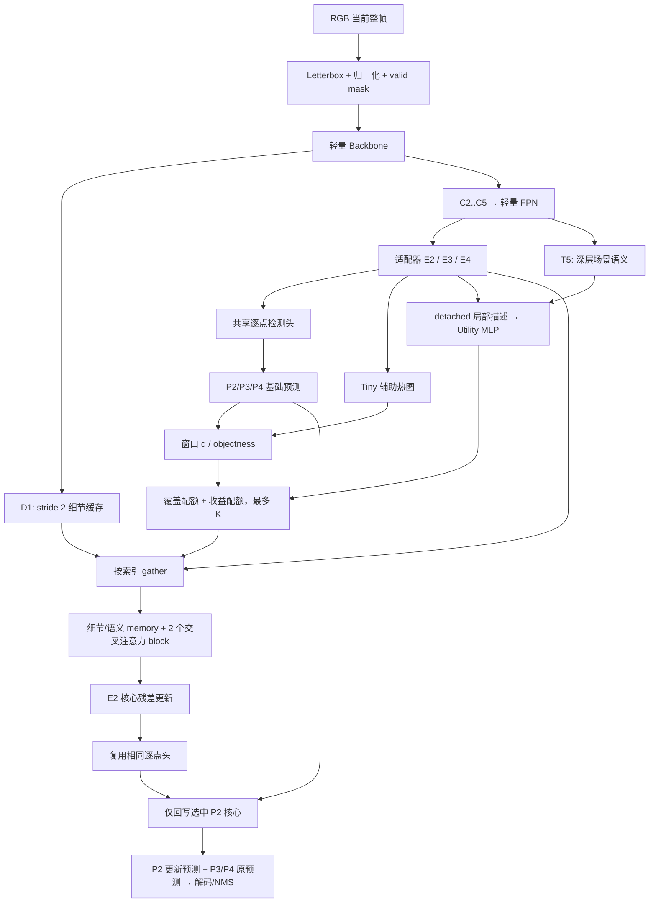

# BCRNet 0.1 详细方案与代码合同

> BCRNet = **Budgeted Contextual Refinement Network**。2026-09-06，TSCRNet-V2 正式更名后的首版实现。
> 本文描述已落入代码的结构。完整研究公式和文献对照见 [研究设计](BCRNet研究设计.md)，工程验证见 [验证记录](验证记录.md)。

## 1. 完整 story

反无人机系统首先需要在当前完整 RGB 图像里找到无人机；单帧检测不能依赖首帧位置或已有轨迹。远距离目标经过缩放后可能只有几个像素，特征下采样会进一步减少空间证据。提高整网分辨率或容量有成本，因此“快速”不能只靠整体压缩，也不能对整张图一视同仁地使用昂贵增强。

弱小无人机与亮点、树梢等背景可能具有相近的局部外观。我们提出的工作假设是：一部分困难区域需要同时查看细尺度细节与邻域语义，才能改善定位或抑制干扰。上下文并不能从缺失的像素中恢复真实信息，只有对照实验才能证明它在具体数据中有效。

目标稀少意味着全图中可能只有少量位置值得额外计算，但“目标分数高”与“增强收益大”不是同一件事：高分目标可能已经足够容易；低分区域可能是漏检，也可能纯粹是背景。直接对目标分数取 Top-K 会偏向已有强响应；纯收益排序又可能因早期估计不准遗漏候选。

因此，BCRNet 保留持续覆盖全图的轻量基础检测路径，把额外细化预算拆为两份：一份保护具有目标/tiny 响应的候选，另一份按预测的局部细化收益排序。选定区域才读取 stride-2 细节缓存与 stride-8 邻域语义，通过交叉注意力更新 stride-4 检测表示。未选区域仍输出基础预测，路由器不充当检测结果的硬过滤器。

收益回归器的训练目标来自同一模型状态下、同一位置在细化前后的检测损失差。推理只读取当前图像特征与预测，不计算 GT 收益、不试跑全部窗口。固定 K 控制额外细化规模；全图基础计算、路由排序和访存成本仍然存在。

**候选创新中心**是弱小 RGB 无人机场景中“双配额的预算分配 + 细节与语义驱动的局部残差修正 + 局部收益监督”的组合及其实证机制。高分辨率检测、稀疏计算、注意力和动态路由本身不是首次提出。需要相同预算对照证明该组合优于随机、单分数选择和普通卷积细化；尚不能凭结构图声称有效或新颖。

| 困难 / 假设 | 需要的能力 | 本版结构 | 关键证据 |
| --- | --- | --- | --- |
| 下采样损失微弱空间证据 | 保留细尺度信息 | D1 缓存 + P2 检测 | 去 D1 的同预算对照 |
| 背景干扰与目标外观相似 | 比较局部细节和语义 | 带 halo 的双来源 memory | 去 context / 卷积替代 |
| 昂贵增强无需铺满全图 | 有界区域计算 | 固定 K、先 gather 后投影 | 实际延迟、显存和执行 MAC |
| 高目标分数不等于高收益 | 同时考虑候选和收益 | q/U 双配额 | 相同 K 的路由消融 |
| 路由漏选仍然可能发生 | 保留全图检测 | 未选核心使用基础头 | 细化前后检测对照 |

## 2. 总体数据流

模型只消费预处理后的图像与 padding mask。标签进入独立的 criterion、训练采样器及评估诊断；不作为普通 forward 的输入。

## 3. 默认张量与空间含义

约定 B=batch，C=类别数（Anti-UAV 为 1），H=W=640，d=64，m=8，h=4，K=16。坐标内部统一连续 xyxy；图像张量顺序 NCHW。H/W 必须整除 lcm(32,4m)，默认 32。

| 名称 | 默认形状 | 含义 |
| --- | --- | --- |
| images / valid_mask | B×3×640×640 / B×1×640×640 bool | RGB 标准化全图；真实缩放图像为 True |
| D1 | B×24×320×320 | 浅层细节缓存，来自同一次 Backbone |
| C2 / C3 / C4 / C5 | B×48×160² / B×96×80² / B×160×40² / B×256×20² | stride 4/8/16/32 特征 |
| P2/P3/P4 | B×64×160² / 80² / 40² | FPN 输出 |
| E2/E3/E4 | 与相应 P 同形 | 检测适配后的表示 |
| T5 | B×64×20² | 最深层侧向投影，无 P5 检测头 |
| Y2b/Y3b/Y4b | B×(C+4)×160² / 80² / 40² | C 中心 logits + 2 offset + 2 log-size |
| Tiny logits | B×1×160×160 | 当前输入尺度下 tiny 中心的辅助响应 |
| q / objectness / U | B×J，J=20×20=400 | 每个不重叠核心一个分数；U 可为负 |
| indices | B×min(K,J) int64 | 行优先核心索引；-1 是无效占位 |
| query | BK×64×64 | 64 个核心位置，每个 64 维 |
| memory | BK×272×64 | 256 个细节 token + 16 个语义 token |
| residual | B×K×64×8×8 | 选中核心的表示增量 |
| 局部 logits | B×K×(C+4)×8×8 | 共享头产生的替换预测 |

J 是几何核心数；有效核心数按真实图像 mask 计算。K 大于 J 时截断。有效核心不足时以 -1 补齐固定形状；占位残差为零，但仍可能发生占位计算，不能声称这部分一定节省延迟。

## 4. 模块逐项说明

### 4.1 预处理：data/transforms.py

输入 PIL RGB 图像与可选原图框，输出归一化图像、有效 mask、变换框和 meta。等比例缩放并居中填充 114；真实水平/垂直缩放分别记录为 sx、sy，避免整数舍入带来的误差。

本版默认 mean=(0.485,0.456,0.406)、std=(0.229,0.224,0.225)。这是固定预处理常数，**不是预训练权重声明**。可在配置中替换为仅由训练集统计的数值。meta 保留原图尺寸、输入尺寸、pad、scale、valid_bounds；训练水平翻转后 meta 不用于逆解码。

### 4.2 Backbone：models/backbone.py

输入 images，输出包含 d1/c2/c3/c4/c5 的字典。

- Stem：3×3 stride-2 Conv + BN + SiLU，3→24。
- 四个 stage：stride-2 depthwise 3×3 + pointwise 1×1 下采样，再接倒残差块。
- stage 通道 48/96/160/256，倒残差块数 1/2/2/2。
- 倒残差：1×1 扩展 2 倍 → 3×3 depthwise → 1×1 无激活投影 → shortcut。

D1 只保留特征供被选区域使用，没有整图 P1 检测头。

### 4.3 Neck 与 adapters：models/neck.py、detector.py

C2..C5 各经 1×1+BN 投影到 64 通道；从 T5 向上最近邻插值，与侧向特征相加，再经深度可分离平滑卷积形成 P4→P3→P2。每层另经深度可分离 adapter 获得 E2/E3/E4。T5 用于场景描述。

mask 由输入有效区域做 adaptive max pooling：cell 与图像有交集即有效。解码时另检查预测中心是否在真实图像内。

### 4.4 共享检测头：models/head.py

输入任一 E 层或选中 E2 核心，输出 C+4 通道：

1. 中心 logits：每类一个，sigmoid 后得到中心响应；
2. offset dx/dy：相对 cell 左上角的连续偏移；
3. logwh：框尺寸除以该层 stride 后的自然对数。

全部是 1×1 卷积，三层与细化前后复用同一组参数。选择逐点头是为了保证局部重预测与整图对应位置语义一致；随意换成带空间卷积的头会改变边界合同。

### 4.5 Tiny head 与窗口描述：models/router.py

Tiny head 为 E2→1 的 1×1 卷积，监督阈值 sqrt(w*h)<16，尺度在最终输入图像中计算。检测分数按类别 max，P3/P4 最近邻映射到 E2 网格后，每个 8×8 核心求峰值。

objectness = 三尺度峰值的 max。q=max(tiny_peak,0.5*objectness)，q 是优先级，不是校准概率。

U 的输入是 85 维：

- E2 有效位置均值 64 维；
- 三尺度峰值 3 维；
- tiny 峰值 1 维；
- P2 最大类别响应的二元熵均值 1 维；
- T5 有效 GAP 64 维，经 trainable 64→16 投影。

前 69 维及 T5 GAP 输入 detach；场景投影不 detach。85→32→1 MLP 输出有符号 U。

### 4.6 双配额选择

默认 K=16：先 q Top-8，再在未选择的有效核心中 U Top-8。无置信度阈值预筛，不重复，不选择纯 padding。稳定排序在同分时保留索引顺序。

Top-K 是离散操作；检测损失不会通过索引反传到路由分数。U 通过独立的收益监督学习，不能称为可微端到端的硬路由。

### 4.7 局部读取：models/refinement.py 的 ContextReader

给定 features、masks、indices：

1. 取 E2 的 8×8 核心及有效 mask。
2. 从 D1 取同位置含 halo 的 32×32 区域；越界补零、无效 mask 清零。pixel_unshuffle(2) 得 96×16×16，经逐 token LN + 96→64 Linear 得 256 个细节 token。
3. 从 E3 取 8×8 语义区域，带 mask 平均池化 2 倍得到 4×4，LN 后形成 16 个语义 token。
4. query 初值 = E2 核心 token + 可学习系数 a_d × 对应细节核心 token，a_d 初始 0.1。
5. memory 为两类 token 拼接，加可学习来源 embedding。有效 memory mask 禁止关注 padding；全空窗口保留一个值为零的占位 key 避免全 -inf softmax。

先选索引再投影，不提前计算整图高成本细节 memory。reader 一次打包 BK 区域；attention 按 patch_chunk_size（默认 32）分块。当前分块不表示完整 reader 流式读取。

### 4.8 细化：ContextRefiner

两个 pre-LN 交叉注意力块：4 heads，维度 64；Q 来自核心，K/V 来自同一份 memory。位置关系以相对半个 E2 cell 的离散偏移编码，查可学习相对偏置表。调用 PyTorch scaled_dot_product_attention，训练/推理 dropout 均为 0。

每块为 attention 残差 + 64→128→64 GELU FFN 残差。最终：

R = a_r × Linear(Q_final - E2_core)，a_r 初始 0.1，输出投影权重 std=1e-3。

R 乘核心有效 mask。细化表示为 E2_core+R，再经共享头预测局部 logits。不能把 R 的极小初始化直接当成模型有精度保证。

### 4.9 回写与输出

scatter_cores 按不重叠核心执行可反传的 delta scatter_add。-1 占位不覆盖索引 0；无效 cell 保留基础 logits。最终 P2 含基础区域与细化区域，P3/P4 不变。没有二次 Backbone、FPN 或整图细化头。

ModelOutput 始终以同一 dataclass 返回；features mode 的预测字典为空。模型不隐式返回 loss 或已 NMS 结果。推理后处理显式完成：

中心 sigmoid → 3×3 局部峰值 → 每层最多 100 候选 → offset/logwh 解码 → 有效中心检查和边界裁剪 → 类别 NMS(0.5) → 最多 100 检测 → 原图坐标。

评估预筛阈值 0.001，单图展示默认 0.25。两者用途不同，应在报告中固定。

## 5. 训练闭合

A 学全图检测和 tiny；B 冻结基础路径学细化；C 冻结 A/B 学 U；D 按推理路由联合微调。默认 epoch 比例 40/25/10/25，具体机制见 [训练与消融](训练与消融.md)。

U 标签是同一核心细化前后局部损失的差，标签 detach、带符号、按训练 EMA 缩放。基础与最终检测共同监督，避免只为少量细化核心优化。存在负帧时保留热图背景项，不强行输出一个无人机。

## 6. 模块可替换边界

BCRNet(config, backbone=..., neck=..., head=..., reader=..., refiner=...) 支持实例注入。router、tiny_head、adapters 是独立 nn.Module，可通过子类/组件替换扩展；数据使用 registry，与模型隔离。模型配置、标签构造、训练策略、后处理相互分离。

第一版采用最小清晰组件边界，未引入大型检测框架、全局状态驱动的插件系统或隐式自动下载权重。修改 backbone 输出通道时同步修改 ModelConfig；修改检测头输出时同步调整 loss、解码与合同测试。

