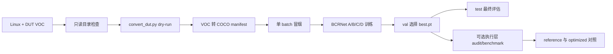

# Linux 服务器上使用 DUT 完成 BCRNet 训练与测试

本文假设 Linux 服务器上只有 DUT 的原始 Pascal VOC 数据，没有 Anti-UAV 数据。目标是从零完成：环境准备、代码获取、DUT 格式检查、VOC→COCO 转换、训练前冒烟、BCRNet 四阶段训练、断点恢复、验证、最终测试，以及可选的算子/图执行优化评估。

算子执行层只改变**推理时局部细化的执行方式**，不参与 BCRNet 训练。建议先用原始 BCRNet 路径完成训练和精度结果，再使用同一个 `best.pt` 比较执行优化；这样可以把模型质量变化和执行路径变化分开。

## 1. 先约定 Linux 路径

Windows 中的 `F:\\antiuav\\dataset\\DUT` 不是 Linux 路径。下面用环境变量表示服务器上的实际位置，请先替换为真实路径：

```bash
export BCRNET_ROOT="$PWD/BCRNet"
export DUT_ROOT="/data/DUT"                         # 服务器上的 DUT 根目录
export DATA_ROOT="/data/bcrnet_data"                # 转换产物
export RUN_ROOT="$BCRNET_ROOT/runs/dut"              # checkpoint 和日志
cd "$BCRNET_ROOT"
```

如果数据实际位于 `/mnt/datasets/DUT`，只需把 `DUT_ROOT` 改成该路径。后文所有命令都使用这些变量，避免把 Windows 盘符直接复制到 Linux shell。

DUT 原始目录应当是：

```text
DUT/
├── train/
│   ├── img/*.jpg
│   └── xml/*.xml
├── val/
│   ├── img/*.jpg
│   └── xml/*.xml
└── test/
    ├── img/*.jpg
    └── xml/*.xml
```

完整流程如下：



## 2. 获取代码并固定版本

在服务器执行：

```bash
cd /data
git clone https://github.com/Econcho/BCRNet.git
cd BCRNet
git checkout main
export BCRNET_ROOT="$PWD"
git rev-parse HEAD
```

应看到包含 BCRNet、`src/bcrnet/execution/`、`scripts/convert_dut.py` 和文档的 `main` 版本。正式实验必须记录上面的 commit；之后不要在同一个实验目录中直接覆盖代码。

如果代码已经通过压缩包传到服务器，也要进入项目根目录执行：

```bash
export BCRNET_ROOT="/data/BCRNet"
cd "$BCRNET_ROOT"
git rev-parse HEAD 2>/dev/null || true
```

## 3. 创建 Python 环境

推荐使用 Anaconda/Miniconda。Python、PyTorch 和 torchvision 必须匹配；CUDA 驱动版本由服务器管理员和 PyTorch 安装命令共同决定，不要只根据 `nvidia-smi` 的显示字符串盲装 wheel。

```bash
conda create -n bcrnet python=3.11 pip -y
conda activate bcrnet
python --version
python -m pip install --upgrade pip
```

先根据服务器驱动和目标 CUDA 版本，从 PyTorch 官方安装页选择对应命令。例如服务器使用 CUDA 12.8 wheel 时，可以使用类似下面的命令；如果服务器环境不同，应替换为官方匹配命令：

```bash
python -m pip install torch torchvision --index-url https://download.pytorch.org/whl/cu128
```

然后安装项目及数据评估依赖：

```bash
cd "$BCRNET_ROOT"
python -m pip install -e ".[data,dev]"
```

`[data]` 提供 OpenCV 和 `pycocotools`，`[dev]` 提供 pytest 和 ruff。`requirements-lock.txt` 是已经记录过的一组版本参考；只有当其中的 PyTorch/CUDA wheel 与服务器兼容时才使用：

```bash
python -m pip install -r requirements-lock.txt
```

安装后先检查 Python、PyTorch、CUDA 和 COCO API，不要直接开始训练：

```bash
python - <<'PY'
import sys
import torch
import torchvision
import yaml
from pycocotools import mask as coco_mask

print("python:", sys.version)
print("torch:", torch.__version__)
print("torchvision:", torchvision.__version__)
print("cuda_available:", torch.cuda.is_available())
if torch.cuda.is_available():
    print("cuda_device:", torch.cuda.get_device_name(0))
print("pyyaml: ok", yaml.__version__)
print("pycocotools: ok", coco_mask.__name__)
PY

python -m bcrnet --help
python -m bcrnet.execution --help
```

若服务器没有 NVIDIA GPU，后续命令把 `--device cuda` 改为 `--device cpu`；完整训练会明显变慢。CPU 只建议用于冒烟和接口检查。

## 4. 检查 DUT 原始数据

先只读检查目录、图片和 XML 数量。下面命令不会修改数据：

```bash
export DUT_ROOT="/data/DUT"
for split in train val test; do
  echo "[$split] images=$(find "$DUT_ROOT/$split/img" -maxdepth 1 -type f \( -iname '*.jpg' -o -iname '*.jpeg' -o -iname '*.png' \) | wc -l) xml=$(find "$DUT_ROOT/$split/xml" -maxdepth 1 -type f -iname '*.xml' | wc -l)"
done

test -d "$DUT_ROOT/train/img" && test -d "$DUT_ROOT/train/xml"
test -d "$DUT_ROOT/val/img" && test -d "$DUT_ROOT/val/xml"
test -d "$DUT_ROOT/test/img" && test -d "$DUT_ROOT/test/xml"
```

转换器会读取每个 XML 的 `filename`、`size` 和 `object/bndbox`。DUT 的坐标按 Pascal VOC 的闭区间习惯解释，因此默认必须使用 `--coordinate-mode inclusive`：`xmax/ymax` 会加 1 转成 COCO 使用的半开区间宽高。不要为了绕过异常随意改为 `half_open`。

转换器默认类别是单类 `UAV`，默认保留空 XML 对应的图片作为负样本，默认把 `difficult=1` 标为 COCO ignore/crowd。严格模式遇到 XML 或图片错误会直接失败，便于在训练前发现数据问题。

## 5. 将 VOC 转换为 COCO

BCRNet 的训练和评估统一读取 COCO manifest。DUT 转换脚本不会修改原始目录，输出目录必须与 `DUT_ROOT` 分开，并且不能已经存在。

### 5.1 先执行 dry-run

```bash
export DATA_ROOT="/data/bcrnet_data"
export DUT_COCO="$DATA_ROOT/DUT_coco_reference_v1"

python scripts/convert_dut.py \
  --source-root "$DUT_ROOT" \
  --output-root "$DUT_COCO" \
  --image-mode reference \
  --coordinate-mode inclusive \
  --strict \
  --dry-run
```

dry-run 只解析 XML 和图片并打印 JSON 统计，不创建输出目录。重点检查：

- `skipped` 是否为空；
- train/val/test 的图片数和框数是否符合服务器数据实际情况；
- `negative_images` 是否合理；
- 类别是否只有 `UAV`；
- 没有 XML 尺寸与图片尺寸不一致、负宽高或找不到图片。

当前已检查过的一份 DUT 快照大致为 train 5200、val 2600、test 2200 张图；这只是参考，服务器上的报告才是本次实验的事实依据。

### 5.2 正式转换

确认 dry-run 后，使用同样参数去掉 `--dry-run`：

```bash
python scripts/convert_dut.py \
  --source-root "$DUT_ROOT" \
  --output-root "$DUT_COCO" \
  --image-mode reference \
  --coordinate-mode inclusive \
  --strict
```

reference 模式不复制图片，生成的 `data.yaml` 的 `root` 指向原始 DUT，适合数据和代码位于同一服务器的场景。若需要把转换产物独立归档，改用 copy 模式和新的输出目录：

```bash
export DUT_COCO_COPY="$DATA_ROOT/DUT_coco_copy_v1"
python scripts/convert_dut.py \
  --source-root "$DUT_ROOT" \
  --output-root "$DUT_COCO_COPY" \
  --image-mode copy \
  --coordinate-mode inclusive \
  --strict
```

转换成功后应至少有：

```text
DUT_coco_reference_v1/
├── annotations/train.json
├── annotations/val.json
├── annotations/test.json
├── conversion_report.json
└── data.yaml
```

检查生成的配置和报告：

```bash
cat "$DUT_COCO/data.yaml"
python - <<'PY'
import json
from pathlib import Path

report = json.loads(Path("/data/bcrnet_data/DUT_coco_reference_v1/conversion_report.json").read_text())
print(json.dumps(report["counts"], indent=2, ensure_ascii=False))
print("skipped:", len(report["skipped"]))
PY
```

如果使用的不是 `/data/bcrnet_data`，把上面 Python 片段中的路径改成真实路径，或直接查看 `conversion_report.json`。

## 6. 训练前冒烟检查

所有输出目录要求为空或不存在；训练器会拒绝覆盖已有非空目录。先做一个只跑少量 batch 的真实 DUT 冒烟：

```bash
export RUN_ROOT="$BCRNET_ROOT/runs/dut"
export DUT_COCO="$DATA_ROOT/DUT_coco_reference_v1"

python -m bcrnet train \
  --config configs/bcrnet.yaml \
  --data "$DUT_COCO/data.yaml" \
  --output "$RUN_ROOT/smoke" \
  --device cuda \
  --mode full \
  --workers 0 \
  --max-batches 1 \
  --stop-after-epochs 1 \
  --no-progress
```

冒烟成功的最低标准：

1. loss、验证指标和 AMP 梯度检查没有非有限值；
2. 输出目录中有 `config.json`、`metrics.jsonl` 和 `last.pt`；
3. `best.pt` 若本轮验证指标刷新也应存在；
4. `config.json` 中 `data.root`、类别映射和预处理尺寸正确；
5. GPU 显存没有溢出。

查看日志：

```bash
cat "$RUN_ROOT/smoke/metrics.jsonl"
```

如果显存不足，先把冒烟命令改为 `--batch-size 1`。正式实验需要把实际 batch size 写入实验记录；不要把不同 batch size 的结果混为同一个消融。

## 7. BCRNet 完整训练

`configs/bcrnet.yaml` 是完整 BCRNet 配置：单类 `UAV`、640 输入、默认 K=16、A/B/C/D 四阶段、AMP、每 epoch 验证、D 阶段 patience=10、保存 `last.pt` 和 `best.pt`。训练阶段如下：

| 阶段 | 作用 |
| --- | --- |
| A | 学习基础全图检测和 tiny 分支 |
| B | 冻结基础路径，学习局部细化 |
| C | 冻结前两阶段，学习局部收益 U |
| D | 使用实际推理路由联合微调 |

正式训练命令：

```bash
export RUN_NAME="dut_full_seed42"
export RUN_DIR="$RUN_ROOT/$RUN_NAME"

python -m bcrnet train \
  --config configs/bcrnet.yaml \
  --data "$DUT_COCO/data.yaml" \
  --output "$RUN_DIR" \
  --device cuda \
  --mode full \
  --workers 2 \
  --progress
```

如果 GPU 显存允许，可把 `--workers` 调到 2 或 4；先从 0 或 2 开始，确认服务器不会因为 DataLoader 多进程产生问题。训练过程中终端会显示 batch 进度、平均 loss 和学习率，验证时会输出验证提示和 JSON 行。

也可以在命令行临时覆盖训练控制：

```bash
python -m bcrnet train \
  --config configs/bcrnet.yaml \
  --data "$DUT_COCO/data.yaml" \
  --output "$RUN_ROOT/dut_full_seed42" \
  --device cuda \
  --workers 2 \
  --val-interval 2 \
  --patience 10 \
  --monitor AP50_95 \
  --early-stop-stage D \
  --progress
```

CLI 参数优先于 YAML。`val_interval=2` 表示每 2 个 epoch 验证一次；阶段切换和最后一个 epoch 仍会强制验证。`patience` 按验证事件计数，不是按 epoch 计数。完整训练进入 D 阶段后才开始用验证指标更新 `best.pt` 和早停状态。

训练目录主要文件：

```text
${RUN_DIR}/
├── config.json       # 本次解析后的模型、数据、训练控制和指纹
├── metrics.jsonl     # 每个 epoch 的 train/val/lr/早停状态
├── last.pt           # 最近完成 epoch 的完整状态
└── best.pt           # 目标阶段监控指标最优状态
```

不要把 `last.pt` 和 `best.pt` 混用：继续训练用 `last.pt`，最终测试通常用 val 选择后的 `best.pt`。

## 8. 断点恢复

恢复训练必须复用相同的配置、数据 manifest、阶段 schedule、mode、batch size、workers 和训练控制。训练器会检查这些字段，不匹配时拒绝恢复，避免把不同实验拼在一起。

```bash
python -m bcrnet train \
  --config configs/bcrnet.yaml \
  --data "$DUT_COCO/data.yaml" \
  --output "$RUN_DIR" \
  --resume "$RUN_DIR/last.pt" \
  --device cuda \
  --mode full \
  --workers 2 \
  --progress
```

恢复是 epoch 边界恢复，不承诺恢复到某个 batch 内部。`last.pt` 包含模型、优化器、scheduler、AMP scaler、criterion 状态、随机数、DataLoader generator、数据指纹和早停计数。
## 9. 验证和最终测试

### 9.1 验证集

先在 val 上检查 checkpoint：

```bash
export BEST="$RUN_DIR/best.pt"
python -m bcrnet evaluate \
  --checkpoint "$BEST" \
  --data "$DUT_COCO/data.yaml" \
  --split val \
  --output "$RUN_ROOT/${RUN_NAME}_eval_val" \
  --device cuda \
  --mode full \
  --workers 0
```

评估输出通常包括 `metrics.json` 和 `detections.json`。主要指标包括 `AP50_95`、`AP50`、`AP75`、COCO 原图面积定义的 `AP_small_original_COCO`、`AR100`，以及负帧误报和路由覆盖诊断。DUT 负样本很少时，误报率的统计不稳定，应同时保留原始数量和每负帧误框数。

### 9.2 最终测试集

只有在模型结构、训练控制、阈值和 checkpoint 选择全部冻结后执行 test：

```bash
python -m bcrnet evaluate \
  --checkpoint "$BEST" \
  --data "$DUT_COCO/data.yaml" \
  --split test \
  --output "$RUN_ROOT/${RUN_NAME}_eval_test" \
  --device cuda \
  --mode full \
  --workers 0
```

不要根据 test 指标回头修改 tiny 阈值、预算 K、输入尺寸、置信度阈值或抽样策略；这些变化应形成新的训练/验证实验。

## 10. 可选的算子/图执行优化流程

训练阶段始终使用普通 BCRNet。执行层只在 `evaluate`、`predict` 和 `python -m bcrnet.execution` 的推理/基准路径中生效。

### 10.1 明确关闭优化

不传 `--execution-config` 时，顶层 BCRNet 命令就是原始 reference 路径。若需要在结果文件中明确记录“配置存在但关闭”，建立一个独立 YAML：

```bash
cat > "$RUN_ROOT/execution_disabled.yaml" <<'YAML'
enabled: false
strategy: indexed
attention_backend: auto
key_tile: 64
overlap_threshold: 1.4
minimum_references: 512
policy_path: null
trace: false
reuse_feature_masks: false
YAML
```

然后运行：

```bash
python -m bcrnet evaluate \
  --checkpoint "$BEST" \
  --data "$DUT_COCO/data.yaml" \
  --split val \
  --output "$RUN_ROOT/${RUN_NAME}_eval_disabled" \
  --device cuda \
  --mode full \
  --execution-config "$RUN_ROOT/execution_disabled.yaml"
```

`enabled: false` 会跳过 `ExecutionBCRNet` 适配器，预测结果中的 execution 元数据会记录 `reason: config_disabled`。这不是换一种执行策略，而是关闭执行优化的显式对照。

### 10.2 启用 packed 执行

复制示例配置到实验目录再修改，避免直接修改仓库模板：

```bash
cp configs/execution.example.yaml "$RUN_ROOT/execution_packed.yaml"
sed -i 's/^enabled: .*/enabled: true/' "$RUN_ROOT/execution_packed.yaml"
sed -i 's/^strategy: .*/strategy: packed/' "$RUN_ROOT/execution_packed.yaml"

python -m bcrnet evaluate \
  --checkpoint "$BEST" \
  --data "$DUT_COCO/data.yaml" \
  --split val \
  --output "$RUN_ROOT/${RUN_NAME}_eval_packed" \
  --device cuda \
  --mode full \
  --execution-config "$RUN_ROOT/execution_packed.yaml"
```

先在 val 上用 `packed` 做数值和延迟检查，再考虑 `shared`、`indexed` 或 `adaptive`。任何优化执行路径都应与 reference 使用同一个 checkpoint、同一个输入尺寸、同一个 mode 和同一个数据 split。

### 10.3 数值审计

执行层自带 audit，会比较 reference 与指定执行器的张量、检测输出顺序和几何分组：

```bash
python -m bcrnet.execution audit \
  --checkpoint "$BEST" \
  --dataset "$DUT_COCO/data.yaml" \
  --split val \
  --executor indexed \
  --device cuda \
  --amp \
  --limit 1000 \
  --output "$RUN_ROOT/execution_audit_indexed_val.json"
```

先检查 JSON 中的 `tensor_checks_passed`、`ordered_detection_agreement`、`detail_ratio` 和 `semantic_ratio`。audit 不是正式 AP 结果，也不使用训练；它的作用是先发现执行层改变了模型数值或路由的情况。

### 10.4 速度基准和自适应策略

用合成张量做执行路径基准：

```bash
python -m bcrnet.execution benchmark \
  --config configs/bcrnet.yaml \
  --checkpoint "$BEST" \
  --device cuda \
  --amp \
  --size 640 \
  --batch-size 1 \
  --warmup 20 \
  --iterations 100 \
  --output "$RUN_ROOT/execution_benchmark_640.json"
```

该 benchmark 测模型执行和局部细化路径，不包括图片读取、预处理、CPU→GPU 拷贝、解码和 NMS。报告中的 MAC 也不等于端到端延迟。只有在数值审计通过后，才可比较 p50/p95 延迟。

如果需要离线选择 adaptive 策略：

```bash
python -m bcrnet.execution calibrate \
  --report "$RUN_ROOT/execution_benchmark_640.json" \
  --budget 16 \
  --halo 4 \
  --shared-strategy indexed \
  --output "$RUN_ROOT/execution_policy_640.json"
```

然后复制 YAML 并改为：

```yaml
enabled: true
strategy: adaptive
attention_backend: auto
policy_path: /data/BCRNet/runs/dut/dut_full_seed42/execution_policy_640.json
```

policy 绑定输入尺寸、预算、模型宽度、PyTorch、设备和 attention backend 等 workload signature。签名不一致时应回退到安全策略，不能把一个 GPU/尺寸校准出的 policy 直接当作所有服务器的通用最优解。

### 10.5 CUDA backend 检查

`attention_backend: auto` 会优先使用可用的 CUDA indexed backend，否则记录原因并回退到可移植的 PyTorch indexed 实现。可先检查服务器：

```bash
python scripts/check_execution_backends.py --output "$RUN_ROOT/execution_backends.json"
cat "$RUN_ROOT/execution_backends.json"
```

不要在 NVRTC、CUDA 驱动或编译条件未确认时强制 `attention_backend: cuda_indexed`。如果服务器不支持该 backend，使用 `auto`，并在报告中保留实际 `backend` 和 `backend_note`。

## 11. 单图预测和结果可视化

训练/评估不需要图形界面。准备一张 DUT 图片后，可以生成叠框图：

```bash
python -m bcrnet predict \
  --checkpoint "$BEST" \
  --image "$DUT_ROOT/val/img/00001.jpg" \
  --output "$RUN_ROOT/predict_reference" \
  --device cuda \
  --mode full
```

执行优化版本：

```bash
python -m bcrnet predict \
  --checkpoint "$BEST" \
  --image "$DUT_ROOT/val/img/00001.jpg" \
  --output "$RUN_ROOT/predict_packed" \
  --device cuda \
  --mode full \
  --execution-config "$RUN_ROOT/execution_packed.yaml"
```

输出目录包含 `prediction.jpg` 和 `prediction.json`。用 reference 与 packed 的叠框、框数量、分数和 `execution` 元数据做快速人工检查；它不能替代整套 val/test 指标。

## 12. 结果归档和实验记录

每个正式实验至少保存以下内容：

```text
experiment/
├── code_commit.txt
├── data/
│   ├── data.yaml
│   └── conversion_report.json
├── config.yaml
├── train/
│   ├── config.json
│   ├── metrics.jsonl
│   ├── best.pt
│   └── last.pt
├── eval_val/metrics.json
├── eval_test/metrics.json
├── execution_audit_*.json
└── execution_benchmark_*.json
```

推荐记录命令：

```bash
git rev-parse HEAD | tee "$RUN_ROOT/${RUN_NAME}_commit.txt"
cp configs/bcrnet.yaml "$RUN_DIR/config.yaml"
cp "$DUT_COCO/data.yaml" "$RUN_DIR/data.yaml"
cp "$DUT_COCO/conversion_report.json" "$RUN_DIR/conversion_report.json"
python -m pip freeze > "$RUN_DIR/pip-freeze.txt"
nvidia-smi > "$RUN_DIR/nvidia-smi.txt" 2>&1 || true
```

不要把真实数据、checkpoint、`runs/` 产物或包含服务器绝对路径的实验文件提交回代码仓库。正式论文表格应同时写明数据转换规则、图片/框/负样本数量、输入尺寸、K、mode、训练 seed、checkpoint 选择规则和是否启用执行优化。

## 13. 常见问题

### `ModuleNotFoundError: pycocotools` 或 `cv2`

确认已经激活 `bcrnet`，并重新执行：

```bash
python -m pip install -e ".[data,dev]"
```

### `torch.cuda.is_available()` 为 `False`

检查 NVIDIA 驱动、PyTorch wheel 和当前环境是否一致：

```bash
which python
python -c "import torch; print(torch.__version__, torch.version.cuda, torch.cuda.is_available())"
nvidia-smi
```

先用 `--device cpu --max-batches 1` 验证数据和代码，再安装与驱动匹配的 PyTorch CUDA wheel。不要把 CPU 训练结果和 CUDA 正式结果混作同一实验。

### `FileExistsError: Run output is nonempty`

训练器不会覆盖已有实验。新实验使用新的目录；同一实验恢复时显式使用 `--resume RUN_DIR/last.pt`，不要删除旧目录后假装恢复。

### `Model/train/val category mapping mismatch`

确认 `data.yaml` 的三个 manifest 都由同一次转换生成，且 `configs/bcrnet.yaml` 保持 `num_classes: 1`。不要把不同类别定义的 manifest 拼到同一实验。

### 显存不足或进程被系统杀死

先减小 `--batch-size`，再降低 DataLoader workers；保持输入 640 和结构不变时，这属于运行资源调整。若同时改输入尺寸、K 或模型宽度，必须作为新的实验配置记录。

### 执行优化 audit 失败

先用不带 `--execution-config` 的 reference 评估，再运行 `python -m bcrnet.execution audit`。检查实际 `backend`、dtype、输入尺寸、halo、K 和模型配置；不要在 audit 失败时直接报告优化后的速度或精度。

### Linux 找不到 Windows 数据路径

把命令中的 `F:\\antiuav\\dataset\\DUT` 换成服务器真实 Linux 路径，例如 `/data/DUT`，并重新生成 `data.yaml`。`data.yaml` 中的 `root` 和 annotation 路径必须在服务器上可读。

## 14. 推荐执行顺序

```text
创建并检查 bcrnet 环境
  ↓
固定 main commit，确认 DUT 六个目录
  ↓
convert_dut.py --dry-run
  ↓
正式生成 DUT_coco_reference_v1/data.yaml
  ↓
真实 DUT 单 batch 冒烟
  ↓
完整 A/B/C/D 训练，保存 last/best 和 metrics.jsonl
  ↓
val 选择 best.pt
  ↓
reference val/test
  ↓
执行层 audit
  ↓
通过 audit 后再 benchmark packed/shared/indexed/adaptive
  ↓
固定全部设置，整理最终 test 与速度结果
```

最重要的边界是：DUT 的 XML 转换、BCRNet 训练、reference 评估和执行优化评估必须分别留下可复查的配置与报告；执行优化关闭时，模型应完全走原始 BCRNet 路径，不能把执行层的速度或失败混入基础检测精度结论。
