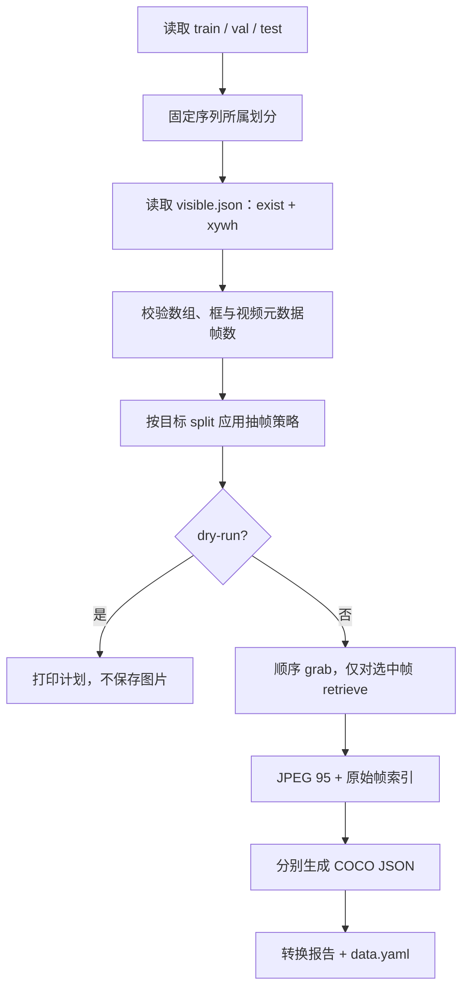

# 数据集与 Anti-UAV RGB 抽帧策略

## 1. 本地数据依据

原始根目录为 F:\antiuav\main_workspace\Anti-UAV-RGBT。只读检查发现 train/val/test 分别有 160/67/91 个序列目录。典型目录如下：

```text
Anti-UAV-RGBT/
  train/<sequence>/visible.mp4
  train/<sequence>/visible.json
  val/<sequence>/visible.mp4
  val/<sequence>/visible.json
  test/<sequence>/visible.mp4
  test/<sequence>/visible.json
  label_new/train.json
  label_new/val.json
  label_new/test.json
```

只使用 visible。visible.json 含逐帧 exist、gt_rect 数组；本地样例已确认 **gt_rect 为 xywh**，例如 [664,542,211,122]。转换为 xyxy 是 [664,542,875,664]。不使用红外文件。

label_new 是序列属性元数据，如 FM/SV/TC 等；不是逐帧框文件。本版仅保存为 attributes_unverified，不用于 RGB 分类监督或未经审核的属性分组评估。

[原论文](https://arxiv.org/abs/2101.08466)的任务是单目标跟踪。这里构建的是自定义单帧全图检测协议，不能把检测 AP 与原跟踪指标直接比较。exist=0 表示被跟踪实例不存在，未必证明画面没有其他无人机；正式实验前仍需人工审核标注完整性。

## 2. 划分原则

**先确定序列所属划分，再决定保留该序列哪些帧。最终产物是图片训练/验证/测试集。** 禁止随机打散所有视频帧后按图片切分，这会把相邻近重复图像混入测试。

- 默认 --split-policy official：保留原 train/val/test；便于复核原始协议。必须披露原 train/val 存在同源拍摄片段。
- 可选 --split-policy group：仅重新划分原 train+val，以拍摄组为单位，默认 20% 组用于 val；原 test 完整保留。按 sequence 最后一个数字片段后缀推断组，如 20190925_101846_1_1 → 20190925_101846_1。实际命名必须符合该含义，不能对别的数据集盲用。
- 分组策略发现 test 与 train/val 拍摄组交叠时直接报错。
- 原目录另有将 test 合并入 train 的旧脚本；本项目不采用这一逻辑。
- official 与 group 应写到不同输出根目录，分别记录结果；不能用测试集选择策略或 K。

## 3. 默认抽帧规则

| 划分/情形 | 规则 | 目的 |
| --- | --- | --- |
| train 普通帧 | 每 5 帧一张，序列名称+seed 决定固定相位 | 减少视频冗余、结果可复现 |
| train tiny 帧 | 缩放到参考 640 后 sqrt(w*h)<16 时，每 2 帧额外采样 | 增加微小目标样本覆盖 |
| train 出现/消失边界 | exist 改变处，前后各 2 帧额外保留 | 覆盖离开/重入与近邻背景 |
| train 单序列上限 | 400 张 | 避免长序列主导训练 |
| 超过上限 | 先保留事件帧，再尽可能给负帧约 25% 名额，正帧按时间均匀补足，最后补齐余量 | 保留事件和背景，减少冗余 |
| val / test | 所有合法帧，默认 stride=1 | 保留原分布，不做 GT 难度择帧 |
| 无效正框 | 跳过整帧并记录原因 | 不把坏标注伪装为负帧 |
| exist=0 | 保留图像，不创建框 annotation | 支持空检测与误报统计 |

25% 是到达 cap 后的尽力配额，不保证所有序列达到；事件过多或负帧不足时会偏离。tiny 判断用于训练抽样，不是模型推理输入。默认 stride 是帧数，非固定秒数；不同 FPS 的视频对应时间间隔不同，转换报告保留 FPS。

该策略是明确的起点而非最优结论。先统计采样后 tiny/负帧/序列分布，再在训练/验证范围调整，不根据测试结果反复改抽帧。

## 4. 脚本流程与安全边界



脚本 scripts/extract_antiuav.py 已编写，**本次没有运行，包括没有对真实数据执行 dry-run**。脚本拒绝覆盖已有输出目录，拒绝输出与原始根目录互为祖先/后代。原视频、标注和划分从不修改。所有参数及消融示例见 [入门教程：数据集抽帧与质量检查](BCRNet入门教程/02_数据集抽帧与质量检查.md)，可直接使用 [YAML 模板](../configs/antiuav_extraction.example.yaml)。

完整抽帧过程只打开 visible 视频。解码索引从 0 开始，与 exist/gt_rect 的第 i 项对应；元数据帧数不匹配时停止。越界框裁剪到图像，正框裁剪后无面积则记录并跳过。exist=0 忽略陈旧框值。JPEG 写出支持中文 Windows 路径。

转换报告包含策略、seed、来源、序列、FPS、计划采样数、忽略原因、最终图片/框数。所有序列成功后才写完整 manifest；中途失败标记 failed，保留部分输出用于排查。当前不支持自动续抽或覆盖式重试，应使用新的输出目录。

## 5. 之后由用户执行的命令

以下命令仅作说明，**本次未执行**。在 BCRNet-main 中、激活 bcrnet 后运行：

```powershell
# 推荐先复制模板、修改 output_root，再只检查计划
Copy-Item 'configs\antiuav_extraction.example.yaml' 'configs\antiuav_extraction_official_v1.yaml'
python scripts/extract_antiuav.py --config configs/antiuav_extraction_official_v1.yaml --dry-run

# 人工确认计划后正式抽帧
python scripts/extract_antiuav.py --config configs/antiuav_extraction_official_v1.yaml

# 同源隔离的辅助实验必须使用另一份 YAML 和另一输出目录
python scripts/extract_antiuav.py --config configs/antiuav_extraction_group_v1.yaml
```

正式训练前建议人工叠框抽查多个序列的首、中、尾帧、负帧和极小框，确认坐标/帧对齐。当前只读 schema 检查和纯采样测试不能替代视频解码对齐检查。

## 6. 输出格式与其他数据集接口

```text
antiuav_rgb/
  images/train/<source_split>_<sequence>/000123.jpg
  images/val/...
  images/test/...
  annotations/train.json
  annotations/val.json
  annotations/test.json
  conversion_report.json
  data.yaml
```

COCO images 行包含 file_name、width、height、sequence_id、source_split、frame_index。annotations 行使用原图 xywh、area、category_id=1、iscrowd=0。无目标图像存在于 images，但没有对应 annotations。

首选将其他数据集转换为同一 COCO 合同，然后设置：

```yaml
type: coco
root: ../my_dataset
splits:
  train: annotations/train.json
  val: annotations/val.json
  test: annotations/test.json
```

root 相对 **YAML 文件目录**解析；annotations 相对 root，image file_name 也相对 root。类别 ID 不必从 0 连续，适配器按 category_id 排序映射到 [0,C)。三份 categories 必须一致，model.num_classes 必须匹配；类别映射随 checkpoint 保存。

自定义数据适配器可 register_dataset("name")，具体接口见 [扩展与实验原则](扩展与实验原则.md)。COCO iscrowd 或 ignore 区域在训练中排除损失；评估将 ignore=true 映射为 crowd 区域。若完整帧标注不可靠，应从 manifest 排除或人工补标，不能把空列表当作已确认背景。
