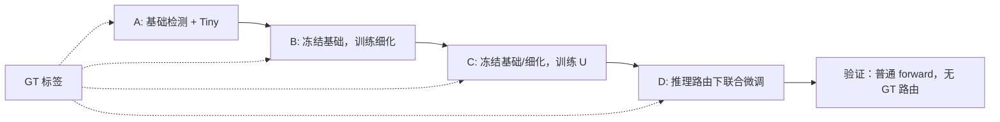
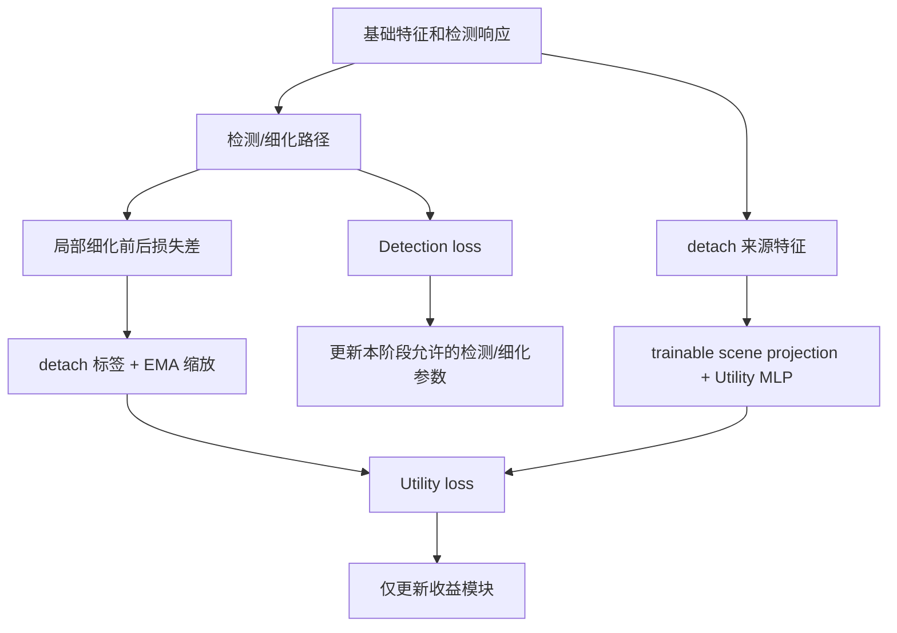

# Forward mode、训练阶段与消融协议

第一次执行实验请先读 [入门教程：首次训练与断点恢复](BCRNet入门教程/04_首次训练与断点恢复.md) 和 [消融实验设计与执行](BCRNet入门教程/06_消融实验设计与执行.md)；本文侧重代码合同与训练机制。

## 1. 模型 forward 合同

```python
output = model(
    images, valid_mask=None,
    mode="full", budget=None,
    generator=None, window_indices=None,
    return_features=False,
)
```

images 是浮点 B×3×H×W，valid_mask 是同设备 B×1×H×W。mode=None 使用 ModelConfig.default_mode，budget=None 使用配置 K。random 和训练采样使用可选 **CPU torch.Generator**。标签不进入这个接口。

返回 ModelOutput：

| 字段 | 含义 |
| --- | --- |
| predictions | 最终 p2/p3/p4 原始预测字典 |
| base_predictions | 同次稠密路径的 p2/p3/p4，用于对照和基础损失 |
| masks | 各特征网格的有效 cell mask |
| mode | 当前实际执行路径名称 |
| tiny_logits | 可选 tiny 热图；base/features 为 None |
| routing | 可选 q、objectness、U、valid_windows、indices |
| refinement | 可选局部基础/细化 logits、残差、core mask、indices |
| features | features mode 必有；其他模式按 return_features 决定 |

模型 train()/eval() 控制 BN 等行为，**不自动改变 forward mode**；阶段冻结由 configure_stage 显式处理。禁止将 model.eval() 当作“自动切换 full”的开关。

## 2. 10 种执行模式

| mode | Tiny（配置启用时） | U MLP | 细化选择 | 用途 |
| --- | --- | --- | --- | --- |
| features | 否 | 否 | 无，且不执行 head | 特征研究/自定义下游 |
| base | 否 | 否 | 无 | 纯基础路径 |
| base_tiny | 是 | 否 | 无 | Tiny 辅助监督 |
| full | 是 | 是 | q 配额 + U 配额 | 默认完整模型 |
| coverage | 是 | 否 | q Top-K | 单候选分数 |
| objectness | 是 | 否 | 三尺度 objectness Top-K | 不用 tiny 分数选择 |
| utility | 是 | 是 | U Top-K | 纯收益排序 |
| random | 是 | 否 | 有效核心随机 K | 预算随机对照 |
| dense | 是 | 否 | 所有有效核心，忽略 K | 全覆盖细化诊断 |
| custom | 是 | 是 | 显式 B×K indices | 手工窗口/GT oracle 诊断 |

objectness/random/dense 当前仍计算 Tiny（若配置启用），便于保留一致训练接口；计算纯净对照可关闭 use_tiny。coverage 等无 U 的模式不会执行场景投影/收益 MLP。

custom 索引需同设备 int64、每图非负索引不重复，范围有效，不能指向纯 padding。-1 可作占位。CLI 不暴露 custom，GT oracle 必须通过显式 Python 诊断调用，不能混入正式测试指标。dense 不是精度数学上界，可能反而带来误修正；不能以未优化的 dense 延迟人为制造优势。

```python
# 任意可部署模式可即时对照；相同模型权重不等于公平独立训练消融
with torch.no_grad():
    result = model(images, mode="full", budget=8)
    indices = result.routing.indices
    manual = model(images, mode="custom", window_indices=indices)
```

base 完全跳过 router、Tiny、refiner，已有 hook 测试验证。budget=0 时 full 仍执行 Tiny 和 U，但不细化；它不是计算量完全相同的 base。

## 3. 结构消融与训练方式

| 目标 | 配置/方式 |
| --- | --- |
| 去掉 D1 细节 | use_detail: false；用 E2 halo 替代细节输入，仍保留 token 投影 |
| 去掉语义上下文 | use_context: false；memory 只含细节，保留 halo |
| 去掉 Tiny | use_tiny: false；q=0.5*objectness，U 的 tiny 描述为零 |
| 普通卷积细化 | refiner_type: conv；同一 reader，DW/GN/PW 残差块 + 池化 context |
| K 消融 | model.budget: 8/16/32，或推理 budget 参数 |
| 配额比例 | coverage_fraction: 0.25/0.5/0.75 |
| 细化宽度/深度 | width、heads、blocks、mlp_ratio |
| 窗口/halo | core_size 为 4 的正倍数，halo 为非负偶数 |

去 detail 替代并不表示参数/MAC完全相同；conv 也不是与 attention 等价的 FLOPs 对照。必须报告真实成本并按研究目的调宽度匹配预算。

基础模型正式训练建议 --stage A --mode base，配置 use_tiny:false；基础+Tiny 用 --stage A --mode base_tiny。完整路径走 A/B/C/D；同预算路由对照在 D 传相应 --mode。结构变化需要重新训练或在明确阶段 warm-start，不能只把 full checkpoint 切换开关便宣称独立消融成功。

## 4. 四阶段流程



| 阶段 | 可训练模块 | 选窗 | 总 loss |
| --- | --- | --- | --- |
| A | backbone、neck、adapter、head、tiny_head | 不细化 | L_base + 0.2 L_tiny |
| B | reader、refiner | 默认 q 8 + 未覆盖 GT 最多 4 + 随机补足 | L_final + 1e-4 L_residual |
| C | router（含 scene projection） | 默认 q 4 + 未覆盖 GT 最多 4 + 随机补足 | L_utility |
| D | 所有模块 | 完全采用请求的可部署 mode | L_final + 0.5 L_base + 0.2 L_tiny + 0.1 L_utility + 1e-4 L_residual |

冻结同时设置 requires_grad=False 和子模块 eval，保证冻结 BN 统计不漂移。无 GT 帧从 q 背景和随机有效窗口补齐。默认 K=16 的规则如表；K 很小时 q 配额截断后可能占满，B/C 的 GT 插入机会减少，应在非默认预算实验中明确记录/调整 training_windows。

D 默认有 10% batch 对 8 个随机未选窗口额外探测，在 no_grad 下生成局部修正，只为 U 提供监督。复用同一次 dense features，不再次执行 Backbone；这些探测不替换最终预测、不计推理成本。extra_utility_probes 是公开接口，可替换采样策略。

训练 schedule 默认 100 epochs 分为 40/25/10/25；阶段切换创建新的 AdamW 和阶段内 cosine scheduler。学习率基础 1e-3，A/B/C/D 系数 1/0.5/1/0.1，weight_decay=0.01，grad_clip=10。epochs 少于 4 不能使用 all，可显式训练某阶段。

训练控制由 YAML 或 CLI 参数决定，CLI 优先：

| 参数 | 含义 |
| --- | --- |
| `val_interval` | 每 N 个 epoch 验证；阶段切换和最终 epoch 强制验证 |
| `patience` | 连续多少次验证无提升后早停；0 为关闭 |
| `min_delta` | 监控指标最小有效提升 |
| `monitor` | `best.pt` 和早停使用的指标，默认 `AP50_95` |
| `early_stop_stage` | 早停开始生效的阶段；完整训练默认 D |
| `progress` | batch 级 tqdm 实时进度条开关 |

每个 epoch 都保存 `last.pt`，进入 `early_stop_stage` 后只有监控指标刷新时保存 `best.pt`。未达到验证周期的 epoch 在 `metrics.jsonl` 中保留训练 loss，但 `val` 为 `null`。早停计数、最佳 epoch 和控制参数会写入 checkpoint，`--resume` 后继续累计。

## 5. 检测监督

内部 box 为输入坐标 xyxy。每层对所有 GT 计算软尺度权重：参考尺度 (16,64,160)，以 log 尺度距离和 sigma=ln2 做 softmax。中心位置取 floor(center/stride)，offset 保留小数；避免极小框因没有 cell 完全落入框内而失去正样本。

Gaussian focal 的中心明确为 1，sigma=clip(size/(6*stride),0.5,4)，只在 3sigma 范围内生成。多个 GT 热图取 max；回归同 cell 冲突时小框优先。共享 offset/logwh 无法表示同 cell 多实例，属于第一版中心头的能力边界。

各层损失为热图 focal + offset SmoothL1 + 0.5 logwh SmoothL1 + GIoU，层系数 1/0.5/0.25；每图除 max(1,N_GT)，背景帧有热图背景项，回归为零。Tiny 使用输入尺度 sqrt(area)<16 的中心热图，按 max(1,N_tiny) 归一化。

padding/ignore 排除损失，GT 中心可覆盖 ignore mask 中的正标签位置。FP32 计算 logits loss、exp、IoU 和归一化，降低 AMP 数值风险。

## 6. 收益监督与梯度隔离

同一个核心、同一批特征，分别计算细化前后局部 P2 损失：

Delta_j = L_local(base_j,GT) - L_local(refined_j,GT)

tiny 中心正项和回归项额外乘 2；两侧使用完全相同的每图归一化、目标和 mask。local patch 解码时共同平移坐标，GIoU 不受平移影响。

Delta detach 后按训练 EMA(|Delta|) 缩放，初次初始化，以 0.05 更新率维护，分母至少 1e-6，裁剪到 [-5,5]，与 U 做 SmoothL1。按 GT 核心、高分背景(q>=0.1)、低分背景三个非空组等权平均；不是按全部窗口数量平均。EMA 与更新计数保存于 criterion checkpoint，推理排序只使用 U。



Delta 是训练损失改善的代理，不保证 AP 改善。U 可负；没有把负收益裁成“无目标”，也没有通过降低 Tiny 来节省计算的 loss。

## 7. 数值、断点与复现

AMP 初始 scale 默认 16，可配置；标准 GradScaler 自动缩小溢出时的 scale 并跳过该次参数更新，日志记录次数。FP32 非有限梯度直接报错，AMP 连续 16 次溢出或一个 epoch 无成功更新也报错，不能将未训练阶段当作完成。loss 非有限一律停止。

checkpoint 保存模型/配置、优化器、scheduler、scaler、criterion EMA、Python/NumPy/CPU/CUDA RNG、DataLoader 和路由 Generator、epoch/stage/schedule、类别映射、预处理、训练和损失设置、manifest SHA256，以及验证周期、早停 patience、监控指标、最佳指标和未提升次数。torch.load 使用 weights_only=True；保存以 partial 文件原子替换。

当前支持 epoch 边界恢复；不支持精确 batch 中途恢复。same-stage 与跨阶段的 CPU 合成训练已验证一致；不保证跨 GPU/驱动/PyTorch 版本逐位一致。manifest hash 不覆盖 JPEG 文件内容，正式实验应另记录数据产物校验清单。

## 8. 评估与实验决策

已实现 AP50_95、AP50、AP75、COCO 原图面积 small AP、AR100、0.25 阈值负帧误报率/每负帧误框数、GT/tiny 核心覆盖率、每图选中窗口数。tiny 覆盖定义基于当前模型输入尺寸；COCO small AP 基于原图 area<32²，两者不可混称。

建议后续补充按输入大小分桶的 AP/Recall、按拍摄组置信区间、序列宏平均、U 与实测 Delta 的排序相关性。这些并未伪装为当前 CLI 已实现功能。测试集只在模型选择结束后评估，先用 val 判断全覆盖细化是否有改善，再比较选窗策略。
