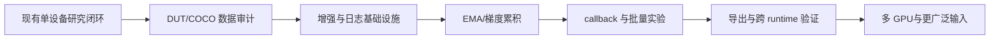

# BCRNet 当前训练系统与 Ultralytics YOLO 对标分析

## 1. 先给结论

BCRNet 当前已经是一个能完成研究闭环的“单设备研究训练器”：有类型化模型配置、COCO 数据接口、A/B/C/D 阶段、AMP、AdamW、阶段 scheduler、断点恢复、warm-start、验证指标、checkpoint 和 CLI。

它还不是 Ultralytics YOLO 那种面向大量用户和生产任务的完整训练平台。最大的差距不在“有没有一个 train 命令”，而在训练平台外围：数据格式与自动检查、预训练与迁移、增强系统、自动 batch/多卡、日志与可视化、回调、导出、部署 benchmark 和通用任务覆盖。

这不意味着 BCRNet 的研究训练器设计错误。BCRNet 先把预算路由、局部细化和收益监督做成可审计的训练流程；对标 YOLO 时应补通用工程能力，同时保护 BCRNet 的阶段冻结和无 GT 推理边界。

## 2. 当前 BCRNet 已经有什么

| 能力 | 当前实现 | 证据/限制 |
| --- | --- | --- |
| 单设备训练 | 有 | `python -m bcrnet train`，CPU/CUDA |
| 数据接口 | 有 COCO；Anti-UAV 通过抽帧导出 COCO；DUT 通过 VOC 转换导出 COCO | 其他原始格式需写转换器或 adapter |
| 输入处理 | RGB、Letterbox、valid mask、训练水平翻转 | 增强很少，暂无 Mosaic/MixUp 等 |
| 模型阶段 | A 基础、B 细化、C 收益、D 联合 | 这是 BCRNet 特有闭环，不能被通用 trainer 随意抹平 |
| 训练控制 | `val_interval`、D 阶段 patience 早停、实时 tqdm、last/best、epoch 边界 resume | 没有 batch 中途恢复、EMA 和多卡 |
| 优化 | AdamW、阶段学习率系数、Cosine scheduler | 没有自动 optimizer/lr finder |
| 数值 | CUDA AMP、GradScaler、梯度裁剪、非有限值检查 | 没有 BF16 配置接口和梯度累积 |
| checkpoint | last/best、模型/优化器/scheduler/scaler/RNG/数据指纹、早停状态 | 只支持 epoch 边界恢复 |
| 验证 | COCO AP50_95/AP50/AP75、small AP、AR、负帧误报、路由覆盖 | 评估输出和绘图能力较少 |
| 推理 | 单图 `predict`、原图坐标、NMS、叠框图 | 没有通用目录/视频/摄像头输入 |
| 速度 | PyTorch forward benchmark 和 MAC 统计 | 不是完整导出格式 benchmark |
| 消融 | 10 个 forward mode、配置开关、阶段参数 | 需要手动批量运行和汇总 |
| 可扩展性 | ModelConfig、dataset registry、可注入模块 | 缺少成熟 plugin/callback 生态 |

## 3. 对标依据

Ultralytics 官方文档把 train、val、predict、export、track、benchmark 作为统一 mode，并提供 CLI 和 Python 两套入口；其配置页还覆盖 patience 早停、resume、auto batch、AMP、fraction、freeze、plots 等训练设置。[官方 Modes 文档](https://docs.ultralytics.com/modes)、[官方配置文档](https://docs.ultralytics.com/usage/cfg)、[官方 CLI 文档](https://docs.ultralytics.com/usage/cli)

Ultralytics 的 benchmark 会把模型在不同导出格式、精度和硬件上的精度与时间放在同一个评测流程中；export mode 支持 ONNX、TensorRT、OpenVINO 等格式。[官方 Benchmark 文档](https://docs.ultralytics.com/modes/benchmark)、[官方 Export 文档](https://docs.ultralytics.com/modes/export)

下面的差距分析以这些公开能力作为“工程平台基线”，不是要求 BCRNet 复制全部代码。

## 4. 差距一：数据系统

### 当前状态

BCRNet 的核心数据适配器是 `CocoDetectionDataset`。它能读取图片、COCO bbox、类别和 ignore/crowd，并统一输出模型需要的 image、mask、target。Anti-UAV 抽帧脚本和新 DUT 转换脚本都将原始数据变成这个合同。

### 缺少的能力

- 数据集 YAML 的 schema 校验与更友好的错误报告；
- 自动检查图片损坏、重复图片、空标注比例、越界框、类别缺失；
- 可选 fraction/subset、缓存、重复采样和类别均衡 sampler；
- 多数据集混合、采样权重和 dataset concatenation；
- 统一的可视化检查命令；
- 训练前自动生成类别/尺寸/框面积统计图。

### 建议优先级

先做一个只读 `bcrnet data-audit`：输出 split 数量、坏图片、重复 hash、类别分布、框面积分桶、负样本和可视化样例。它会直接降低 Anti-UAV 与 DUT 接入的排错成本，比先加入复杂 sampler 更重要。

## 5. 差距二：模型初始化与迁移学习

### 当前状态

BCRNet 默认随机初始化；`--weights` 支持按名称和形状加载兼容权重，`--resume` 恢复同一实验的优化器、scheduler、AMP 和 RNG。模型配置、类别映射、数据指纹不匹配会拒绝 resume。

### 缺少的能力

- 官方或项目内预训练权重注册与下载校验；
- backbone-only 迁移、head 排除、冻结层策略；
- 预训练权重和新类别 head 的自动适配；
- 权重版本、来源、许可证和 checksum 记录；
- 更清晰的 warm-start 报告，例如加载比例和未加载模块统计。

### 建议

先增加显式的 `init` 配置：`random`、`checkpoint`、`backbone_checkpoint`，并在 checkpoint metadata 中保存来源。不要把 Anti-UAV 单类 head 直接迁移成 DUT 多类 head；类别语义相同时也要单独报告 head 是否重置。

## 6. 差距三：数据增强

### 当前状态

训练目前只有可配置概率的水平翻转。几何变换通过 Letterbox 和目标框同步完成。

### 缺少的能力

YOLO 训练平台通常会提供丰富且可配置的几何/颜色增强、Mosaic/MixUp/CutMix、最后若干 epoch 关闭 Mosaic、增强概率和可复现实验记录。BCRNet 暂无这些能力。

### BCRNet 的特殊风险

小目标研究不能无条件照搬 Mosaic。拼接后目标像素尺寸、背景上下文和 tiny 标签分布都会改变；如果增强引入四张图和新的边界条件，可能把“模型结构收益”和“增强收益”混在一起。

### 建议顺序

先实现可关闭、可记录的 `color_jitter`、`random_crop/resize` 和水平翻转；每个增强单独做开关。Mosaic/MixUp 放在基础数据协议稳定后，并为 tiny 框、padding、ignore 和路由窗口写专门测试。

## 7. 差距四：训练控制

### 当前状态

BCRNet 有阶段 schedule、阶段冻结、阶段 optimizer 重建、CosineAnnealingLR、AMP、梯度裁剪、可配置 `val_interval`、D 阶段 patience 早停、实时 tqdm 进度条和 `--stop-after-epochs`。每个 epoch 保存 `last.pt`，监控指标刷新时保存 `best.pt`；早停计数和控制参数进入 checkpoint。这是研究闭环中很重要的一部分。

### 缺少的能力

- 梯度累积和自动 batch；
- BF16、梯度 checkpointing、EMA；
- 多 GPU DDP；
- 更丰富的 optimizer、scheduler、warmup 和参数组规则；
- 每 epoch 的可视化样例和学习率曲线；
- 训练失败后的自动恢复和异常 checkpoint。

### 建议顺序

1. 增加梯度累积，checkpoint 保存累积步和 optimizer 状态；
2. 增加 EMA 并明确 best 是 raw 还是 EMA 权重；
3. 补充优雅中断后的 emergency checkpoint；
4. 最后再做 DDP，因为 BCRNet 的阶段冻结、路由随机数和 DataLoader sampler 需要一起设计。

## 8. 差距五：验证、日志与可视化

### 当前状态

训练日志是 `metrics.jsonl`，评估输出 JSON；支持 AP、负帧误报、tiny/GT 核心覆盖和选窗数量。

### 缺少的能力

- TensorBoard、CSV、W&B 等可选 logger；
- Precision-Recall、F1、混淆矩阵和 per-image metrics 的统一导出；
- best/last/EMA 对比；
- 自动保存 train/val 样例、预测叠框、失败案例；
- 按序列/拍摄组的统计与置信区间；
- 训练曲线可视化和多 logger 汇总。

### 建议

先实现本地无依赖的 PNG/CSV 汇总，再提供 TensorBoard adapter。logger 不应成为训练必需依赖；每个 logger 都只消费事件，不改变 forward 或 loss。

## 9. 差距六：CLI、实验管理和 callbacks

### 当前状态

CLI 使用子命令和 `--key value`，每个输出目录要求为空；训练/评估/预测/benchmark 分开。模块没有通用 callbacks。

### 缺少的能力

- 类似 `train/val/predict/export/benchmark` 的统一生命周期事件；
- `on_fit_start`、`on_epoch_end`、`on_validation_end` 等可插拔 callback；
- 自动递增实验目录、配置快照、git commit 和环境信息；
- 批量网格实验与汇总工具；
- CLI 参数 schema/help 与 YAML 合并优先级统一化。

### BCRNet 的实现建议

callback 只能观察或显式修改训练上下文，不能偷偷改变路由或注入 GT。BCRNet 的 B/C 阶段训练选窗需要保留为核心训练逻辑，而不是让通用 callback 伪装成模型行为。

## 10. 差距七：导出与部署接口

### 当前状态

BCRNet 可进行 PyTorch 推理和 forward benchmark；模型输出、后处理和 checkpoint 分离，具有进一步导出的基础。

### 缺少的能力

- ONNX/TorchScript 导出；
- 动态/静态输入 shape 选择；
- 导出后的 NMS、后处理和类别元数据合同；
- 导出模型回读验证；
- 不同 runtime 的精度与延迟对照；
- 量化和校准集接口。

这些属于后续部署工作，不能混入当前 BCRNet 第一创新点的精度实验。第一步应是建立 PyTorch 输出与导出输出的数值审计，再扩展 runtime。

## 11. 差距八：通用任务和输入源

Ultralytics 还提供视频/摄像头预测、tracking、多任务和多种格式输入；BCRNet 当前是单帧 RGB 检测器，单图 predict 是最完整的推理入口。官方 Predict 文档列出的 source 可以是图片、目录、视频、URL 或设备，BCRNet 尚未覆盖这些输入形态。[官方 Predict 文档](https://docs.ultralytics.com/modes/predict)

这不是当前研究缺陷。Anti-UAV 原任务与 BCRNet 当前 story 都明确采用单帧 RGB。视频目录推理可以作为工具层补充，但不能让 tracking 的时序信息悄悄进入检测模型实验。

## 12. 推荐的演进路线

优先补能直接减少实验误差的能力：DUT 接入、数据审计、配置快照、日志/曲线和多 seed 汇总。自动 batch、DDP、导出和大规模平台能力放在模型训练协议稳定以后。

## 13. 不应为了“像 YOLO”而改变的东西

- BCRNet 的 A/B/C/D 阶段和收益监督；
- 训练时可使用 GT 选窗、但推理不使用 GT 的边界；
- `base/full/dense/custom` 等显式 forward mode；
- 固定预算 K 和未选区域保留基础预测的语义；
- checkpoint 对配置、类别映射和数据指纹的严格校验；
- Anti-UAV 与 DUT 分别冻结 split、只用 val 选方案的实验纪律。

Ultralytics 的工程能力可以作为平台参考，但 BCRNet 的创新假设和可审计边界才是研究核心。平台增强应服务于可复现性，不能让训练器的自动行为掩盖模型差异。
